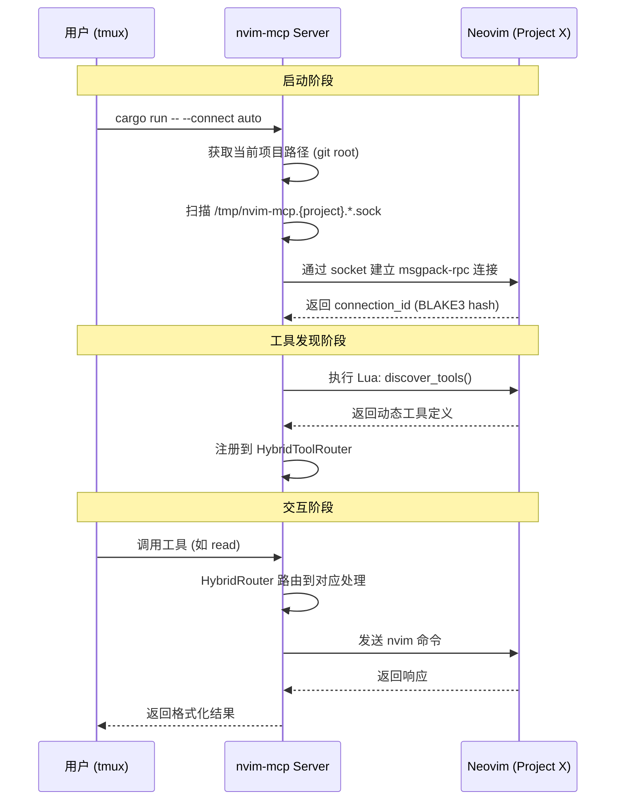
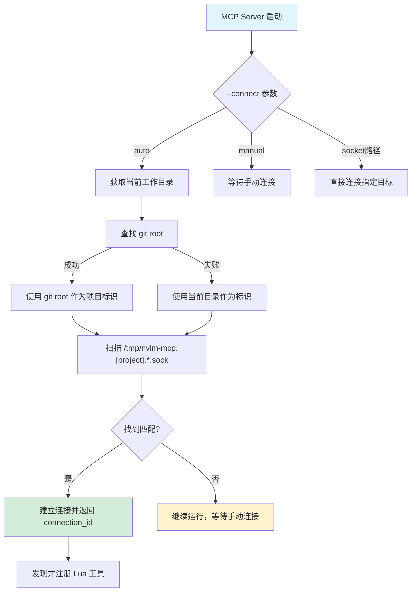
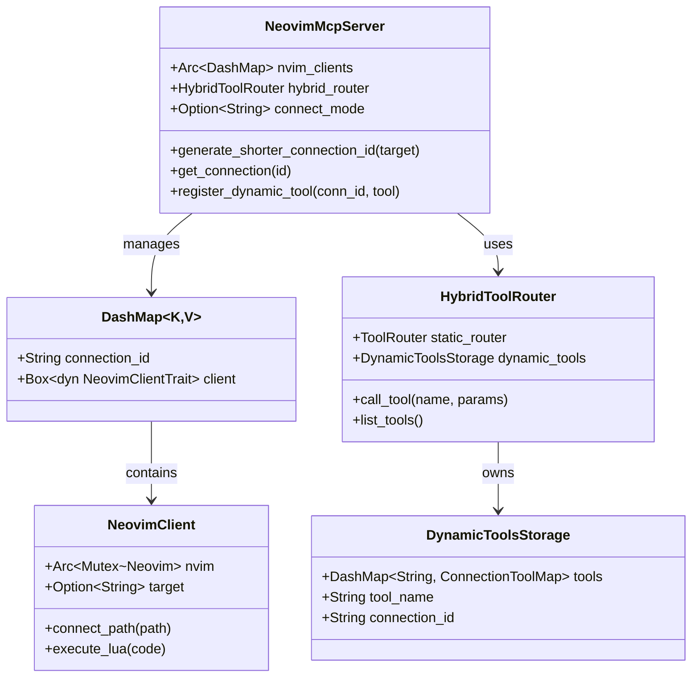
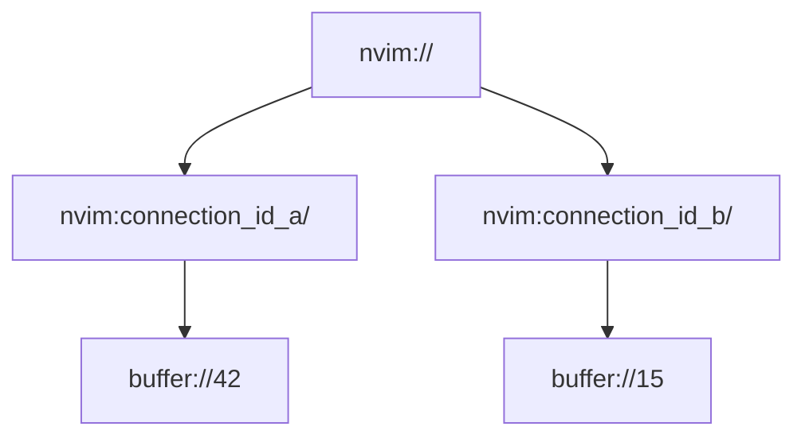
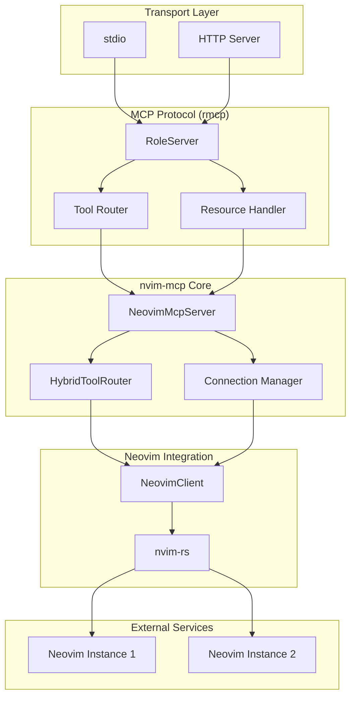

# nvim-mcp 架构详解

## 1. 项目概述

nvim-mcp 是一个基于 Rust 的 MCP (Model Context Protocol) 服务器，作为 AI 助手与 Neovim 编辑器之间的桥梁。

```
┌─────────────────────────────────────────────────────────────────────────────┐
│                              MCP Client (Claude)                            │
│                              claude "analyze @nvim-connections://"         │
└────────────────────────────────┬────────────────────────────────────────────┘
                                 │
                                 │ MCP Protocol (stdio / HTTP)
                                 │
┌────────────────────────────────▼────────────────────────────────────────────┐
│                           nvim-mcp Server (Rust)                            │
│  ┌─────────────────────┐  ┌─────────────────────┐  ┌─────────────────────┐  │
│  │   Static Tools      │  │   Hybrid Router     │  │  Dynamic Tools      │  │
│  │   (32 tools)        │  │   (tool routing)    │  │  (Lua-discovered)   │  │
│  └─────────────────────┘  └─────────────────────┘  └─────────────────────┘  │
│  ┌─────────────────────┐  ┌─────────────────────┐  ┌─────────────────────┐  │
│  │   Connection Mgr    │  │   Resources         │  │  Auto Discovery     │  │
│  │   (DashMap)         │  │   (connections)     │  │  (socket scanning)  │  │
│  └─────────────────────┘  └─────────────────────┘  └─────────────────────┘  │
└────────────────────────────────┬────────────────────────────────────────────┘
                                 │
                                 │ msgpack-rpc (nvim-rs)
                                 │
┌────────────────────────────────▼────────────────────────────────────────────┐
│                              Neovim Instances                               │
│  ┌──────────────────┐  ┌──────────────────┐  ┌──────────────────┐          │
│  │  Project A/tmux  │  │  Project B/tmux  │  │  Project C/tmux  │          │
│  │  /tmp/nvim-mcp.  │  │  /tmp/nvim-mcp.  │  │  /tmp/nvim-mcp.  │          │
│  │  project-a.*.sock│  │  project-b.*.sock│  │  project-c.*.sock│          │
│  └──────────────────┘  └──────────────────┘  └──────────────────┘          │
└─────────────────────────────────────────────────────────────────────────────┘
```

---

## 2. 核心架构流程

### 2.1 连接建立流程



---

## 3. tmux 多 Session 识别机制详解

### 3.1 问题场景

```
┌────────────────────────────────────────────────────────────────┐
│                        tmux Session                             │
│  ┌─────────────┐  ┌─────────────┐  ┌─────────────┐              │
│  │   Window 1  │  │   Window 2  │  │   Window 3  │              │
│  │   (project-a)│  │   (project-b)│  │   (project-a)│              │
│  │             │  │             │  │             │              │
│  │  Neovim #1  │  │  Neovim #2  │  │  Neovim #3  │              │
│  │  ~/proj-a   │  │  ~/proj-b   │  │  ~/proj-a   │              │
│  │             │  │             │  │             │              │
│  │ Socket:     │  │ Socket:     │  │ Socket:     │              │
│  │ nvm-mcp.p-a │  │ nvm-mcp.p-b │  │ nvm-mcp.p-a │              │
│  │ .1234.sock  │  │ .5678.sock  │  │ .9999.sock  │              │
│  └─────────────┘  └─────────────┘  └─────────────┘              │
└────────────────────────────────────────────────────────────────┘
                          │
                          │ MCP Server 启动目录决定识别范围
                          ▼
```

### 3.2 Socket 文件命名规则

```rust
// 核心代码: src/server/core.rs
format!("{temp_dir}/nvim-mcp.{escaped_project_path}.{pid}.sock")

// 实际示例:
// /tmp/nvim-mcp.%home%user%projects%myapp.12345.sock
// /tmp/nvim-mcp.%home%user%projects%myapp.12346.sock  ← 同项目多实例
// /tmp/nvim-mcp.%home%user%work%other.23456.sock      ← 不同项目
```

### 3.3 项目识别流程



---

## 4. 组件架构图

### 4.1 静态 vs 动态工具对比

```
┌─────────────────────────────────────────────────────────────────────────────┐
│                         Hybrid Tool Router                                  │
├───────────────────────────────┬─────────────────────────────────────────────┤
│      Static Tools (Rust)      │         Dynamic Tools (Lua)                 │
├───────────────────────────────┼─────────────────────────────────────────────┤
│                               │                                             │
│  ┌─────────────────────┐      │    ┌─────────────────────────────────────┐  │
│  │ Connection Mgmt     │      │    │ Connection 1 Tools                  │  │
│  │ ─────────────────── │      │    │ ┌──────────┐ ┌──────────┐          │  │
│  │ • get_targets       │      │    │ │ format() │ │ lint()   │          │  │
│  │ • connect           │      │    │ └──────────┘ └──────────┘          │  │
│  │ • connect_tcp       │      │    └─────────────────────────────────────┘  │
│  │ • disconnect        │      │                                             │
│  └─────────────────────┘      │    ┌─────────────────────────────────────┐  │
│                               │    │ Connection 2 Tools                  │  │
│  ┌─────────────────────┐      │    │ ┌──────────┐ ┌──────────┐          │  │
│  │ Navigation          │      │    │ │ test()   │ │ build()  │          │  │
│  │ ─────────────────── │      │    │ └──────────┘ └──────────┘          │  │
│  │ • navigate          │      │    └─────────────────────────────────────┘  │
│  │ • cursor_position   │      │                                             │
│  │ • list_buffers      │      │    ┌─────────────────────────────────────┐  │
│  └─────────────────────┘      │    │ Connection 3 Tools                  │  │
│                               │    │ ┌──────────┐ ┌──────────┐          │  │
│  ┌─────────────────────┐      │    │ │ deploy() │ │ debug()  │          │  │
│  │ Buffer/Document     │      │  {                                          │
│  │ ─────────────────── │      │    "connection_id": "conn_abc123",          │
│  │ • read              │      │    "other_params": ...                      │
│  └─────────────────────┘      │                                             │
│                               │                                             │
│  编译时确定，所有连接共享      │  运行时从 Neovim Lua 发现                    │
│                               │                                             │
└───────────────────────────────┴─────────────────────────────────────────────┘
```

### 4.2 连接管理数据结构



---

## 5. 错误处理层级

```
┌─────────────────────────────────────────────────────────────────────────────┐
│                            Error Hierarchy                                  │
├─────────────────────────────────────────────────────────────────────────────┤
│                                                                             │
│  ┌─────────────────────────────────────────────────────────────────────┐   │
│  │                    ServerError (Top Level)                           │   │
│  │  ┌─────────────────────────────────────────────────────────────┐    │   │
│  │  │  MCP Protocol Error (rmcp::ErrorData)                        │    │   │
│  │  │  • invalid_request()  ← NeovimError::Connection              │    │   │
│  │  │  • internal_error()   ← NeovimError::Api                     │    │   │
│  │  └─────────────────────────────────────────────────────────────┘    │   │
│  └─────────────────────────────────────────────────────────────────────┘   │
│                                     ▲                                       │
│                                     │ From trait impl                        │
│  ┌─────────────────────────────────────────────────────────────────────┐   │
│  │                    NeovimError (Domain Specific)                     │   │
│  │  ┌─────────────┐  ┌─────────────────────────────┐                 │   │
│  │  │ Connection  │  │            Api               │                 │   │
│  │  │ ─────────── │  │ ─────────────────────────── │                 │   │
│  │  │ • Connect   │  │ • Nvim API call failed      │                 │   │
│  │  │ • Timeout   │  │ • Unexpected response       │                 │   │
│  │  │ • NotFound  │  │ • Serialization error       │                 │   │
│  │  └─────────────┘  └─────────────────────────────┘                 │   │
│  └─────────────────────────────────────────────────────────────────────┘   │
│                                     ▲                                       │
│                                     │ Conversion                            │
│  ┌─────────────────────────────────────────────────────────────────────┐   │
│  │                    External Errors                                   │   │
│  │  ┌─────────────┐  ┌─────────────┐  ┌─────────────┐  ┌─────────────┐ │   │
│  │  │   std::io   │  │  nvim-rs    │  │   serde     │  │    rmpv     │ │   │
│  │  │   Error     │  │   Error     │  │   Error     │  │   Error     │ │   │
│  │  └─────────────┘  └─────────────┘  └─────────────┘  └─────────────┘ │   │
│  └─────────────────────────────────────────────────────────────────────┘   │
│                                                                             │
└─────────────────────────────────────────────────────────────────────────────┘
```

---

## 6. 资源 URI 系统

### 6.1 连接作用域资源



### 6.2 URI 格式

```
┌────────────────────────────────────────────────────────────────────────────┐
│                          Resource URI Patterns                              │
├────────────────────────────────────────────────────────────────────────────┤
│                                                                            │
│  基础格式:  nvim:{connection_id}://{resource_type}/{identifier}            │
│                                                                            │
│  ┌─────────────────────────────────────────────────────────────────────┐  │
│  │ Connection 1 (abc123):                                              │  │
│  │   nvim:abc123://buffer/42        → Buffer 42 的内容                  │  │
│  └─────────────────────────────────────────────────────────────────────┘  │
│                                                                            │
│  ┌─────────────────────────────────────────────────────────────────────┐  │
│  │ Connection 2 (xyz789):                                              │  │
│  │   nvim:xyz789://buffer/15        → Buffer 15 的内容                  │  │
│  └─────────────────────────────────────────────────────────────────────┘  │
│                                                                            │
└────────────────────────────────────────────────────────────────────────────┘
```

---

## 7. 启动模式对比

```
┌─────────────────────────────────────────────────────────────────────────────┐
│                        Connection Modes                                     │
├───────────────────┬───────────────────┬─────────────────────────────────────┤
│      auto         │      manual       │           specific                  │
├───────────────────┼───────────────────┼─────────────────────────────────────┤
│                   │                   │                                     │
│ ┌─────────────┐   │ ┌─────────────┐   │  ┌─────────────────────────────┐   │
│ │ 扫描项目    │   │ │ 不自动连接  │   │  │ cargo run --                │   │
│ │ 所有 Neovim │   │ │             │   │  │   --connect 127.0.0.1:6666  │   │
│ │ socket      │   │ │ 用户手动    │   │  │                             │   │
│ └─────────────┘   │ │ 调用工具    │   │  │ 或:                         │   │
│                   │ │ 建立连接    │   │  │ --connect /tmp/nvim.sock    │   │
│ ┌─────────────┐   │ │             │   │  │                             │   │
│ │ 自动连接    │   │ │ get_targets │   │  │ 直接连接到                  │   │
│ │ 所有匹配    │   │ │ → connect   │   │  │ 指定地址                    │   │
│ │ 实例        │   │ │             │   │  │                             │   │
│ └─────────────┘   │ └─────────────┘   │  └─────────────────────────────┘   │
│                   │                   │                                     │
│ 适用场景:         │ 适用场景:         │  适用场景:                          │
│ • 单一项目        │ • 需要精确控制    │  • 远程 Neovim                      │
│ • 开发工作流      │ • 跨项目操作      │  • 特定实例                         │
│                   │                   │                                     │
└───────────────────┴───────────────────┴─────────────────────────────────────┘
```

---

## 8. 依赖关系图



---

## 9. 关键设计决策

### 9.1 为什么选择 BLAKE3 生成 connection_id?

```rust
// src/server/core.rs
pub fn generate_shorter_connection_id(&self, target: &str) -> String {
    let full_hash = b3sum(target);  // BLAKE3 hash
    let id_length = 7;               // 取前 7 字符

    // 碰撞检测: 如果冲突，尝试 hash 的其他位置
    for start in 0..=(full_hash.len().saturating_sub(id_length)) {
        let candidate = &full_hash[start..start + id_length];
        // 检查是否已存在且目标不同
        if let Some(existing) = self.nvim_clients.get(candidate) {
            if existing.target() == target {
                return candidate.to_string();  // 同一目标，复用 ID
            }
            continue;  // 不同目标，继续查找
        }
        return candidate.to_string();
    }
    full_hash  // 回退到完整 hash
}
```

**优点**:
- 确定性: 同一目标总是生成相同 ID，支持连接复用
- 简短: 7 字符便于用户输入和显示
- 安全: BLAKE3 抗碰撞，确保不同目标不会冲突

### 9.2 为什么使用 DashMap?

```rust
pub nvim_clients: Arc<DashMap<String, Box<dyn NeovimClientTrait + Send>>>
```

| 特性 | HashMap + Mutex | DashMap |
|------|----------------|---------|
| 并发读取 | 串行 | 并行分片 |
| 锁粒度 | 整个 map | 单个 bucket |
| 适合场景 | 低并发 | 高并发、多连接 |

### 9.3 为什么分离 Static 和 Dynamic 工具?

```
┌────────────────────────────────────────────────────────────────┐
│                    Tool Separation                             │
├──────────────────────────┬─────────────────────────────────────┤
│      Static Tools        │         Dynamic Tools               │
├──────────────────────────┼─────────────────────────────────────┤
│ 编译期确定               │ 运行期发现                          │
│ 类型安全 (Rust)          │ 灵活性 (Lua)                        │
│ 跨连接共享               │ 连接隔离                            │
│ 性能最优                 │ 用户可扩展                          │
│                          │                                     │
│ 核心功能:                │ 项目特定:                           │
│ - Buffer 操作            │ - 自定义 format                     │
│ - 连接管理               │ - 项目 build 命令                   │
│                          │ - 测试运行                          │
└──────────────────────────┴─────────────────────────────────────┘
```

---

## 10. 使用示例: tmux 多项目工作流

```bash
# ============ Terminal 1: Project A ============
cd ~/projects/web-app
nvim src/main.ts
# 自动生成 socket: /tmp/nvim-mcp.%home%user%projects%web-app.12345.sock

# ============ Terminal 2: Project B ============
cd ~/projects/api-server
nvim src/server.rs
# 自动生成 socket: /tmp/nvim-mcp.%home%user%projects%api-server.67890.sock

# ============ Terminal 3: MCP Server ============
# 场景 1: 在 Project A 目录启动 → 只连接 web-app 的 Neovim
cd ~/projects/web-app
cargo run -- --connect auto
# 输出: INFO Auto-connected to 1 project instances

# 场景 2: 在 Project B 目录启动 → 只连接 api-server 的 Neovim
cd ~/projects/api-server
cargo run -- --connect auto

# 场景 3: 手动跨项目操作
cargo run -- --connect manual
# 然后通过 get_targets 查看所有可用连接
# 再调用 connect 连接特定目标
```
