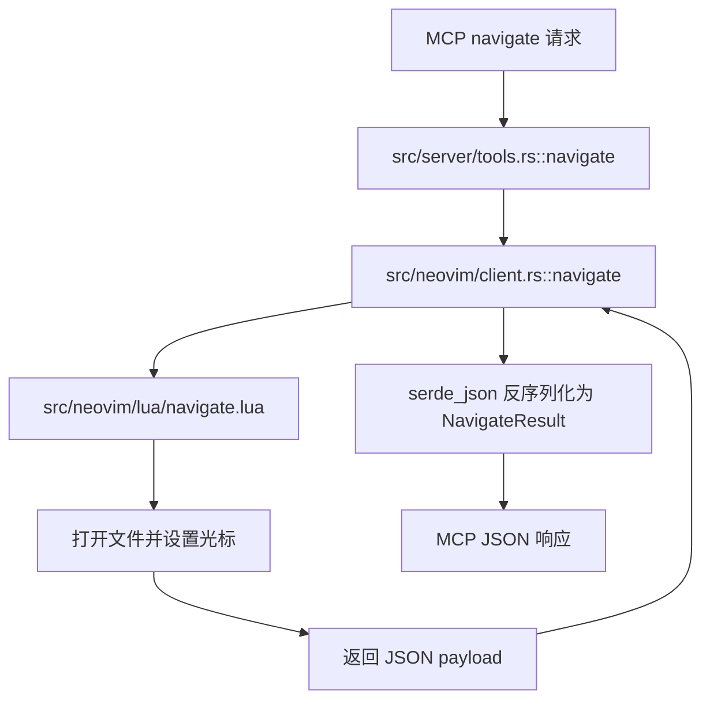

# Dev Plan: navigate 工具返回契约修复

## 输入前置条件表

| 类别 | 内容 | 是否已提供 | 备注 |
|------|------|------------|------|
| 仓库/模块 | `src/neovim/client.rs`、`src/neovim/lua/navigate.lua`、`src/server/tools.rs`、`src/server/integration_tests.rs`、`docs/tools.md` | 是 | 已结合 `log_analysis_report_20260314_215843.md` 与 `findings.md` 核对 |
| 目标接口 | MCP `navigate` 工具；Neovim Lua `navigate.lua`；`NavigateResult` 返回结构 | 是 | 目标为修复导航成功但结果解析失败 |
| 运行环境 | Rust 2024、`rmcp`、`tokio`、`nvim-rs`、Neovim RPC、嵌入 Lua | 是 | `Cargo.toml` 已确认 `edition = "2024"`、`rust-version = "1.88.0"` |
| 约束条件 | 不应破坏现有 `DocumentIdentifier` 输入兼容；不应弱化测试断言；优先小范围修复 | 是 | 用户明确要求先写 bugfix 计划，不直接写实现 |
| 已有测试 | `src/server/integration_tests.rs:test_navigate_tool`；相关 read 测试；无单独 navigate 文档测试 | 是 | 现有 navigate 集成测试断言与 Rust 返回结构不一致 |
| 需求来源 | `log_analysis_report_20260314_215843.md`、`findings.md`、本地代码检查、本次对话 | 是 | 无独立 issue / PRD 编号 |

## 输入信息处理规则

- 已知信息：
  - 主故障为 `navigate.lua` 返回 `{success, buffer_name, line=当前行文本}`，Rust `NavigateResult` 期望 `{path, line: u64, column: u64}`，导致 `serde_json` 解析失败。
  - 现有 `test_navigate_tool` 与文档 `docs/tools.md` 仍按旧返回语义描述/断言。
  - 同一批日志还暴露了陈旧 `connection_id` 显示为 `Unknown` 的次级问题。
- 缺失信息：
  - 当前对外公开 API 最终应以“Rust schema”还是“现有文档/测试旧语义”为准，尚无 maintainer 明确决议。
  - 是否必须在本次修复中一并处理陈旧连接展示问题，尚无强制要求。
- 当前假设：
  - 本计划默认以 `src/neovim/client.rs` 中 `NavigateResult { path, line, column }` 为目标契约，因为它已进入 Rust 类型和 MCP JSON 返回链路。
  - “陈旧连接显示为 `Unknown`”本次只做风险跟踪与验证，不默认纳入主修复范围，除非在阶段 1 复核后确认它直接阻碍验收。

## 1. 概览（Overview）

- 一句话目标：修复 `navigate` 工具在导航成功后因 Lua/Rust 返回 payload 失配而报错的问题，并把测试与文档统一到单一契约。
- 优先级：`[P0]`
- 预计时间：3.5h - 5h
- 当前状态：`[PLANNING]`
- 需求来源：`log_analysis_report_20260314_215843.md`、`findings.md`、代码核对结果
- 最终交付物：一套统一的 `navigate` 返回契约、对应测试回归、文档同步，以及可复核的验证记录

## 2. 背景与目标（Background & Goals）

### 2.1 为什么要做（Why）

- 问题描述：`navigate` 实际已打开目标文件并移动光标，但返回结果在 Rust 侧反序列化失败，用户收到 `MCP error -32603`。
- 当前痛点：用户感知为“导航失败”，但真实故障是结果编码不一致，属于伪失败；现有测试未拦截该问题，说明契约已长期漂移。
- 触发原因：Lua `navigate.lua` 返回了旧格式 `{success, buffer_name, line=当前行文本}`，而 Rust、工具序列化与日志诊断希望消费 `{path, line, column}`。
- 预期收益：
  - 消除 `navigate` 的伪失败。
  - 让测试真实覆盖当前公开契约，而不是掩盖问题。
  - 降低后续 Agent / MCP 客户端对返回值的歧义理解。

### 2.2 具体目标（What）

1. 统一 `navigate` 的单一返回契约，并在 Lua、Rust、集成测试、文档中保持一致。
2. 新增或修正能稳定复现该问题的测试覆盖，至少覆盖 `absolute_path`、`project_relative_path`、`buffer_id` 三类入口中的关键场景。
3. 保持现有错误路径行为不退化，尤其是无效文件路径仍返回失败。
4. 在不扩大重构范围的前提下，确认“陈旧连接显示为 `Unknown`”是否影响本次验收，并明确是否进入后续任务。

### 2.3 范围边界、依赖与风险（Out of Scope / Dependencies / Risks）

| 类型 | 内容 | 说明 |
|------|------|------|
| Out of Scope | 全量重构连接生命周期管理 | 本次不默认处理 `get_targets` / `list_tools` 的历史连接清理逻辑 |
| Out of Scope | 重新设计 `DocumentIdentifier` 输入模型 | 仅修复 `navigate` 返回契约，不改输入兼容策略 |
| Out of Scope | 新增动态工具发现或路由机制 | 与本 bug 根因无关 |
| Dependencies | `src/neovim/lua/navigate.lua` | 返回 payload 的直接生产者 |
| Dependencies | `src/neovim/client.rs` | `NavigateResult`、Lua 执行和 JSON 解析入口 |
| Dependencies | `src/server/integration_tests.rs` | 当前唯一直接覆盖 navigate 行为的集成测试 |
| Dependencies | `docs/tools.md` | 当前文档描述仍停留在旧返回语义 |
| Risks | Rust 类型与现有文档语义冲突 | 若存在外部调用方依赖旧字段，修复可能触发兼容性讨论 |
| Risks | `project_relative_path` 测试依赖 Neovim 工作目录 | 测试若未固定 cwd，可能导致结果不稳定 |
| Risks | 连接 `Unknown` 问题干扰人工验收 | 若真实复现，会影响手工验证步骤但不改变主根因 |
| Assumptions | `NavigateResult { path, line, column }` 为目标契约 | 基于现有 Rust 类型、工具序列化路径和日志分析结论 |
| Assumptions | 本次应优先修正 Lua 返回，而不是降低 Rust 解析要求 | 符合最小改动原则，也与日志报告推荐方向一致 |

### 2.4 成功标准与验收映射（Success Criteria & Verification）

| 目标 | 验证方式 | 类型 | 通过判定 |
|------|----------|------|----------|
| `navigate` 返回契约统一为 `{path, line, column}` | `cargo test test_navigate_tool -- --nocapture` | 自动 | 测试通过，且断言返回 JSON 中 `path` 为目标文件绝对路径、`line`/`column` 为数字 |
| `project_relative_path` 入口被覆盖且不再出现解析错误 | 在 `test_navigate_tool` 或新增 navigate 测试中加入 `project_relative_path` 场景并运行该测试 | 自动 | 测试通过，日志中不再出现 `Failed to parse navigate result` |
| 无效文件路径仍失败 | `cargo test test_navigate_tool -- --nocapture` | 自动 | 无效路径断言仍通过，未被“成功返回”掩盖 |
| 文档与实现一致 | `rg -n "success status, buffer name, and current line content|path, line, column" docs/tools.md src/neovim/client.rs` | 自动 | `docs/tools.md` 不再描述旧返回结构，且与 `NavigateResult` 一致 |
| 真实 MCP 导航链路可人工确认 | 使用真实 Neovim 连接执行一次 `navigate` 到项目内文件 | 人工 | 返回 JSON 可解析，且字段含义与文档一致，不出现 `-32603` |

## 3. 技术方案（Technical Design）

### 3.1 高层架构



高层说明：

- 服务端 `src/server/tools.rs` 只是透传 `document + position` 到 Neovim client，并把 `NavigateResult` 序列化成 MCP 输出。
- 真正的契约边界在 `src/neovim/client.rs` 与 `src/neovim/lua/navigate.lua` 之间。
- 本次修复的核心是让 Lua 返回与 Rust `NavigateResult` 完全同构，并让测试/文档都围绕这一同构结果断言。

### 3.2 核心流程

1. MCP 收到 `navigate(connection_id, document, line, character)`。
2. Rust 解析 `DocumentIdentifier`，将 `project_relative_path` / `absolute_path` / `buffer_id` 转成可导航目标。
3. Rust 调用 `navigate.lua`，Lua 打开目标 buffer 并设置光标。
4. Lua 读取当前 buffer 路径与当前光标位置，构造统一结果。
5. Rust 将该结果反序列化为 `NavigateResult` 并返回给 MCP 调用方。
6. 集成测试与文档只允许围绕这一个结果结构建立断言与描述。

ASCII 数据流：

```text
request(document, line, character)
  -> resolve_text_document_identifier()
  -> execute_lua(navigate.lua)
  -> lua returns { path, line, column }
  -> serde_json::from_str::<NvimExecuteLuaResult<NavigateResult>>()
  -> MCP response JSON
```

### 3.3 技术栈与运行依赖

- 语言 / 框架：Rust 2024、Lua、Tokio、RMCP
- 数据库：无
- 缓存 / 队列 / 中间件：无
- 第三方服务：无
- 构建、测试、部署相关依赖：
  - `cargo build`
  - `cargo test`
  - `./scripts/run-test.sh -- --show-output`
  - `pre-commit run --all-files`
  - 本地可用 Neovim 实例 / socket（集成测试与人工验证依赖）

### 3.4 关键技术点

- `[CORE]` 明确 `navigate` 的唯一输出契约，禁止 Lua / Rust / 测试各自维护不同语义。
- `[CORE]` `project_relative_path` 必须进入回归覆盖，因为线上复现来自该入口。
- `[NOTE]` Lua 当前把 `line` 写成行文本，修复时必须返回数值型位置，且保持 0-based 语义对外一致。
- `[NOTE]` `string_or_struct` 输入兼容是现有行为，本次不应误伤。
- `[OPT]` 若实现中容易拿到实际光标列，可同步返回真实列；否则需明确 0-based 约定与来源。
- `[COMPAT]` 文档和测试当前隐含旧契约，修复前需确认是否存在外部依赖方；若无证据，则按 Rust 类型统一。
- `[ROLLBACK]` 若修复后发现外部调用依赖旧字段，回滚点应停留在“测试先改但实现未发布”之前，而不是继续引入兼容双格式。

### 3.5 模块与文件改动设计

#### 模块级设计

- `src/neovim/`：
  - `client.rs` 继续作为 Rust 侧 navigate 契约定义与解析入口。
  - `lua/navigate.lua` 改为返回与 `NavigateResult` 同构的数据。
- `src/server/`：
  - `tools.rs` 预期无需改核心逻辑，但需确认无需额外适配。
  - `integration_tests.rs` 修正为断言规范结果，并补充 `project_relative_path` 场景。
- `docs/`：
  - `docs/tools.md` 同步 `navigate` 返回结构说明，消除旧字段描述。

#### 文件级改动清单

| 类型 | 路径 | 说明 |
|------|------|------|
| 修改 | `src/neovim/lua/navigate.lua` | 统一返回 `{path, line, column}`，移除旧 `{success, buffer_name, line=文本}` 语义 |
| 修改 | `src/neovim/client.rs` | 视需要补充注释、解析保护或相关测试辅助；保持 `NavigateResult` 作为目标契约 |
| 修改 | `src/server/integration_tests.rs` | 修正 navigate 断言并补充 `project_relative_path` 场景 |
| 修改 | `docs/tools.md` | 更新 `navigate` 返回说明 |
| 待确认 | `src/server/core.rs` | 仅在阶段 1 复核后确认“Unknown 连接”必须修时才纳入 |

### 3.6 边界情况与异常处理

- 空输入：`document` 缺失仍应在参数层失败，本次不改变。
- 非法参数：不存在的 `absolute_path` / `project_relative_path` 必须继续报错。
- 并发冲突：本次不改多连接或并发导航语义。
- 外部依赖失败：Neovim 未连接或连接失效时，应继续返回连接错误，不应由 navigate 静默兜底。
- 兼容旧数据：若外部调用方依赖旧字段，本次需在风险评估中显式记录，而不是同时维持两套契约。
- 超时 / 重试 / 幂等性：本次不新增自动重试；失败保留原有报错路径。
- 坐标换算：Lua 内部使用 1-based 行号设置光标，对外返回必须仍保持 0-based。
- Buffer 已打开：返回路径与坐标应一致，不应因复用 buffer 改变返回结构。

### 3.7 测试策略

- 单元测试：
  - 若 `NavigateResult` 解析或位置换算提炼出独立辅助逻辑，可补充最小单测。
  - 若未提炼，不强行新增形式化单测。
- 集成测试：
  - 修改 `src/server/integration_tests.rs:test_navigate_tool`，断言 `{path, line, column}`。
  - 增加 `project_relative_path` 场景，覆盖本次真实复现入口。
  - 保留无效路径失败断言。
- 回归测试：
  - 至少运行 `test_navigate_tool`。
  - 如改动触达共享路径解析逻辑，再运行相关 read 测试验证 `DocumentIdentifier` 未回归。
- lint / typecheck / build：
  - `cargo build`
  - `pre-commit run --all-files`
- 必要的人工验证：
  - 使用真实 Neovim socket 走一次 `connect -> navigate(project_relative_path)`，确认不再返回 `-32603`。

## 4. 实施计划（Implementation Plan）

### 4.1 执行基本原则（强制）

1. 所有任务必须可客观验证。
2. 任务必须单一目的、可回滚、影响面可控。
3. Task N 未验证通过，禁止进入 Task N+1。
4. 失败必须记录原因和处理路径，禁止死循环。
5. 禁止通过弱化断言、硬编码结果、跳过校验来“伪完成”。

### 4.2 分阶段实施

#### 阶段 1：准备与基线确认 ` [TODO] `

- 阶段目标：冻结根因、确认目标契约、跑出当前失败基线。
- 预计时间：30m - 45m
- 交付物：根因确认记录、目标契约决议、当前失败测试输出
- 进入条件：已拿到日志分析文档、`findings.md`、相关代码路径
- 完成条件：确认本次以 `{path, line, column}` 为目标契约，且当前基线失败可被稳定复现

#### 阶段 2：核心实现 ` [TODO] `

- 阶段目标：修复 Lua/Rust 契约失配并同步测试断言
- 预计时间：90m - 150m
- 交付物：代码改动、更新后的集成测试、必要文档改动
- 进入条件：阶段 1 完成且目标契约已冻结
- 完成条件：核心测试通过，文档不再描述旧返回语义

#### 阶段 3：测试与验证 ` [TODO] `

- 阶段目标：完成自动验证与人工链路确认
- 预计时间：45m - 60m
- 交付物：测试结果、人工验证记录、风险复核结论
- 进入条件：阶段 2 完成且 focused test 已通过
- 完成条件：关键自动验证通过，人工验证无 `-32603`

#### 阶段 4：收尾与完成确认 ` [TODO] `

- 阶段目标：收口风险、确认超范围项状态、形成最终交付结论
- 预计时间：15m - 30m
- 交付物：最终状态更新、遗留风险说明、完成确认
- 进入条件：阶段 3 完成
- 完成条件：Definition of Done 全部满足，未处理项都被明确记录

### 4.3 Task 列表（必须使用统一模板）

#### Task 1: 冻结 navigate 目标契约并复现当前失败

| 项目 | 内容 |
|------|------|
| 目标 | 以证据确认主根因为返回契约失配，并冻结本次修复以 `NavigateResult { path, line, column }` 为目标 |
| 代码范围 | `src/neovim/client.rs`、`src/neovim/lua/navigate.lua`、`src/server/integration_tests.rs`、`docs/tools.md` |
| 预期改动 | 无代码改动；输出执行基线与契约决议 |
| 前置条件 | 日志报告与 `findings.md` 可用；仓库可运行测试 |
| 输出产物 | 基线失败记录、目标契约确认、风险注记 |
| 当前状态 | `[TODO]` |

**验证命令 / 检查方式**：

```bash
rg -n "NavigateResult|Failed to parse navigate result|success = true|buffer_name|current line content" \
  src/neovim/client.rs \
  src/neovim/lua/navigate.lua \
  src/server/integration_tests.rs \
  docs/tools.md

cargo test test_navigate_tool -- --nocapture
```

**通过判定**：

- [PASS] 已确认 Lua 返回与 Rust 类型不一致，且 `test_navigate_tool` 当前不能证明正确契约
- [PASS] 已在执行记录中明确本次采用 `{path, line, column}` 作为目标契约

**失败处理**：

- 先核对是否测试环境未连上 Neovim，避免把环境问题误当根因
- 最多允许 2 次重复复现
- 若 2 次后仍无法得到稳定基线，升级为 `[BLOCKED]`，要求人工确认测试环境

**门禁规则**：

- [BLOCK] 未拿到稳定基线和目标契约前，禁止进入下一个 Task

#### Task 2: 先修测试，让 navigate 回归覆盖真实契约

| 项目 | 内容 |
|------|------|
| 目标 | 让集成测试先表达正确返回结构，并纳入 `project_relative_path` 场景 |
| 代码范围 | `src/server/integration_tests.rs` |
| 预期改动 | 修改现有 `test_navigate_tool` 的断言；补充 `project_relative_path` 检查；保留无效路径失败断言 |
| 前置条件 | Task 1 完成 |
| 输出产物 | 失败中的测试或新增断言，能准确暴露契约问题 |
| 当前状态 | `[TODO]` |

**验证命令 / 检查方式**：

```bash
cargo test test_navigate_tool -- --nocapture
```

**通过判定**：

- [PASS] 测试在修复前能够因返回契约不一致而失败，而不是继续接受旧 `{success, buffer_name, line=文本}` 结构
- [PASS] 测试覆盖至少一个 `project_relative_path` 场景

**失败处理**：

- 若测试因环境问题失败，先修复测试前置条件，不改生产代码
- 最多允许 2 次调整测试夹具/路径选择
- 超过阈值后标记为 `[BLOCKED]`，回到路径解析假设复核

**门禁规则**：

- [BLOCK] 测试未能稳定表达目标契约前，禁止进入下一个 Task

#### Task 3: 修复 Lua 到 Rust 的 navigate 返回 payload

| 项目 | 内容 |
|------|------|
| 目标 | 让 `navigate.lua` 返回与 `NavigateResult` 同构的 `{path, line, column}`，消除反序列化失败 |
| 代码范围 | `src/neovim/lua/navigate.lua`、必要时 `src/neovim/client.rs` |
| 预期改动 | 调整 Lua 成功返回；必要时补充 Rust 注释或轻量保护逻辑；不引入双格式兼容 |
| 前置条件 | Task 2 已形成失败测试 |
| 输出产物 | 最小代码修复，使 focused test 转为通过 |
| 当前状态 | `[TODO]` |

**验证命令 / 检查方式**：

```bash
cargo test test_navigate_tool -- --nocapture
cargo build
```

**通过判定**：

- [PASS] `test_navigate_tool` 通过
- [PASS] 不再出现 `Failed to parse navigate result`
- [PASS] `navigate` 成功返回中 `path` 为字符串、`line`/`column` 为数字且语义明确

**失败处理**：

- 先打印/检查 Lua 实际返回 JSON，再判断是字段名、坐标换算还是 Rust 解析问题
- 最多允许 3 次小范围修复重试
- 超过阈值后标记为 `[BLOCKED]`，回到契约设计并人工确认是否需要兼容策略

**门禁规则**：

- [BLOCK] focused test 和 `cargo build` 未通过前，禁止进入下一个 Task

#### Task 4: 同步公开文档，移除旧返回语义

| 项目 | 内容 |
|------|------|
| 目标 | 让文档对 `navigate` 的返回描述与实现、测试一致 |
| 代码范围 | `docs/tools.md` |
| 预期改动 | 将旧“success status / buffer name / current line content”描述改为统一结果结构 |
| 前置条件 | Task 3 完成 |
| 输出产物 | 文档更新 |
| 当前状态 | `[TODO]` |

**验证命令 / 检查方式**：

```bash
rg -n "navigate|success status|buffer name|current line content|path|line|column" docs/tools.md
```

**通过判定**：

- [PASS] 文档不再描述旧返回字段
- [PASS] 文档中 `navigate` 返回说明与 `NavigateResult` 一致

**失败处理**：

- 若文档与实现存在冲突，优先回查 Task 1 的契约决议
- 最多允许 2 次修正文案
- 超过阈值后标记为 `[BLOCKED]`，等待人工决定公共 API 文案

**门禁规则**：

- [BLOCK] 文档未同步前，禁止进入下一个 Task

#### Task 5: 完成自动回归与人工链路验证

| 项目 | 内容 |
|------|------|
| 目标 | 验证修复没有引入回归，并确认真实 MCP 链路不再伪失败 |
| 代码范围 | 已修改文件及相关测试/运行命令 |
| 预期改动 | 无代码改动；产出验证记录 |
| 前置条件 | Task 4 完成 |
| 输出产物 | 自动测试结果、人工验证记录、次级风险结论 |
| 当前状态 | `[TODO]` |

**验证命令 / 检查方式**：

```bash
cargo test test_navigate_tool -- --nocapture
./scripts/run-test.sh -- --show-output
pre-commit run --all-files
```

人工检查点：

- 使用真实 Neovim 连接执行一次 `navigate` 到项目内已存在文件，例如 `{"project_relative_path":"src/main.rs"}`。
- 确认返回 JSON 为 `{path, line, column}`，且没有 `-32603`。
- 复核 `get_targets` / 连接状态是否仍出现 `Unknown`；若仍出现，只记录为后续项，不阻塞本次主修复完成，除非它直接导致人工验收失败。

**通过判定**：

- [PASS] 自动测试命令通过
- [PASS] 人工链路验证通过
- [PASS] “Unknown 连接”若仍存在，已被记录为独立遗留项而非未说明风险

**失败处理**：

- 若 focused test 通过但全量测试失败，先定位是否为无关失败，禁止顺手扩大修复范围
- 最多允许 2 次针对本次改动范围内的问题修复
- 超过阈值后标记为 `[BLOCKED]`，停止继续扩展修复面

**门禁规则**：

- [BLOCK] 全部验证未通过前，禁止标记本计划完成

## 5. 失败处理协议（Error-Handling Protocol）

| 级别 | 触发条件 | 处理策略 |
|------|----------|----------|
| Level 1 | 单次验证失败 | 原地修复，禁止扩大重构 |
| Level 2 | 连续 3 次失败 | 回到假设和接口定义，重新核对输入输出 |
| Level 3 | 仍无法通过 | 停止执行，记录 Blocker，等待人工确认 |

### 重试规则

- 每次修复必须记录变更范围。
- 每次重试前必须更新状态。
- 同一类失败不得无限重复。
- 达到阈值必须升级，不得原地空转。

## 6. 状态同步机制（Stateful Plan）

这份 Plan 不是静态文档，而是执行状态机。每次任务切换、验证完成、失败重试、阶段收尾都必须更新状态。

### 状态标记规范

| 标记 | 含义 |
|------|------|
| [TODO] | 未开始 |
| [DOING] | 进行中 |
| [DONE] | 已完成且验证通过 |
| [BLOCKED] | 阻塞 |
| [PASS] | 当前验证通过 |
| [FAIL] | 当前验证失败 |

### 强制要求

- 每一轮执行必须更新状态。
- 未验证通过前禁止标记 `[DONE]`。
- 遇到问题必须记录失败原因和阻塞点。
- 若阶段完成，必须同步更新阶段状态。

## 7. Anti-Patterns（禁止行为）

- `[FORBIDDEN]` 禁止删除或弱化现有断言
- `[FORBIDDEN]` 禁止为了通过测试而硬编码返回值
- `[FORBIDDEN]` 禁止跳过验证步骤
- `[FORBIDDEN]` 禁止引入未声明依赖
- `[FORBIDDEN]` 禁止关闭 lint / typecheck / 类型检查以规避问题
- `[FORBIDDEN]` 禁止修改超出范围的模块
- `[FORBIDDEN]` 禁止在未记录原因的情况下扩大重构范围

违反后的动作：

- Task 标记为 `[BLOCKED]`
- 必须回滚到最近一个验证通过点
- 必须记录触发原因

## 8. 最终完成条件（Definition of Done）

- 所有计划内 Task 已完成
- 所有关键验证已通过
- 没有未记录的 blocker
- 约束条件仍被满足
- 交付物已齐备
- 成功标准与验收映射表中的项目全部完成

## 9. 质量检查清单

- [x] 所有目标都有验证方式
- [x] 所有 Task 都有验证方式
- [x] 所有 Task 都具备原子性和可回滚性
- [x] 已明确 Out of Scope
- [x] 已明确依赖与风险
- [x] 已明确文件级改动范围
- [x] 已定义失败处理协议
- [x] 已定义 Anti-Patterns
- [x] 已定义最终完成条件
- [x] 当前 Plan 可被 Agent 连续执行
- [x] 当前结构可转换为 Ralph Spec
