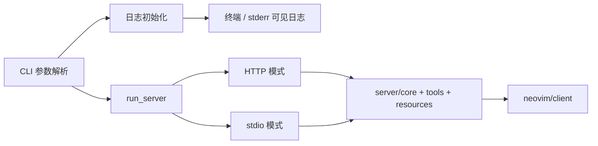

# Dev Plan: 移除临时调试日志落盘与排障探针

## 输入前置条件表

| 类别 | 内容 | 是否已提供 | 备注 |
|------|------|------------|------|
| 仓库/模块 | `src/main.rs`、`src/logging.rs`、`src/server/*`、`src/neovim/client.rs`、`README.md`、`docs/usage.md`、`docs/development.md` | 是 | 已通过仓库检索确认 |
| 目标接口 | CLI 启动流程、`--log-file` / `--log-level`、stdio/HTTP 服务启动、Neovim 交互链路 | 是 | 目标是移除调试落盘与临时排障代码，不破坏现有交互 |
| 运行环境 | Rust 2024、`tracing=0.1.44`、`tracing-subscriber=0.3.22`、`tracing-appender=0.2`、`rmcp=0.14`、`nvim-rs=0.9.2` | 是 | 来自 `Cargo.toml` |
| 约束条件 | 不破坏功能；后端正常启动后应能看到交互；不再强制写入 `debug_log.txt`；保留 `src/logging.rs` 文件 | 是 | 来自用户 2026-03-17 口头需求 |
| 已有测试 | `src/main.rs` 存在 `prepare_debug_log_file_recreates_empty_file`；集成测试在 `src/server/integration_tests.rs`、`src/neovim/integration_tests.rs` | 是 | 日志契约覆盖不足 |
| 需求来源 | 用户口头变更请求 | 是 | 本次会话输入 |

### 已知信息

- 当前 `src/main.rs` 会无条件调用 `default_debug_log_path()` 和 `init_debug_logging()`，将日志固定写入项目根目录 `debug_log.txt`。
- 当前 `src/logging.rs` 提供了专门服务于 `debug_log.txt` 的准备、格式化和文件 appender 逻辑。
- 当前运行时代码中存在大量排障型日志文案与上下文字段，如 `context_id`、`phase`、`调用栈`、`数据流`、`任务开始/完成/失败`。
- `README.md`、`docs/usage.md`、`docs/development.md` 等文档与当前实现存在不一致，文档仍描述 `--log-file` / `stderr` 的常规行为。
- 仓库中存在依赖 `debug_log.txt` 的临时复现脚本：`scripts/repro_http_resume_session_bug.py`。

### 缺失信息

- 用户未逐条点名“去查二级问题的代码”精确包含哪些文件与辅助脚本。
- 用户未明确说明是否要彻底删除 `--log-file` CLI 能力，还是仅取消默认强制落盘。
- 用户未明确说明是否需要清理历史分析文档、临时报告、未跟踪 Markdown 草稿。

### 当前假设

- 本计划按“移除默认强制写入 `debug_log.txt` + 清理为排障临时加入的运行时代码 + 保留正常服务功能”执行。
- 为避免破坏兼容性，优先假设保留已公开的 CLI 参数语义，至少保证默认启动时日志可直接在终端可见。
- 历史分析报告与草稿文档不作为本次核心交付物，除非它们会误导当前正式使用文档。

---

## 1. 概览（Overview）

- 一句话目标：移除 `debug_log.txt` 强制落盘和临时排障探针，恢复后端服务的常规可见日志行为，同时保持 stdio/HTTP 与 Neovim 交互功能不回退。
- 优先级：`[P0]`
- 预计时间：4 至 6 小时
- 当前状态：`[PLANNING]`
- 需求来源：用户于 2026-03-17 提出的口头变更请求
- 最终交付物：一组经过验证的代码与文档改动，使默认启动不再写 `debug_log.txt`，临时排障代码被清理，核心交互功能保持正常

## 2. 背景与目标（Background & Goals）

### 2.1 为什么要做（Why）

当前服务启动路径被改造成“默认强制写 `debug_log.txt` + 输出大量排障型结构化日志”。这套逻辑是为近期问题定位而加入的临时诊断能力，但已经改变了原本的日志契约和用户体验：

- 默认启动时会在仓库根目录生成 `debug_log.txt`
- `--log-file` 参数当前被忽略，和文档描述不一致
- 运行时日志包含大量“调用栈/数据流/phase/context_id”等排障信息，噪声较高
- 多个模块耦合到这套排障格式，后续维护成本上升

触发原因是用户不再需要这些临时调试代码，只希望正常启动后端服务时能直接看到交互，不再依赖文件日志。预期收益：

- 恢复合理的默认日志行为
- 降低运行时代码复杂度与噪声
- 消除文档与实现不一致
- 为后续功能迭代减少临时诊断代码负担

### 2.2 具体目标（What）

1. 默认启动 `nvim-mcp` 时不再强制创建或写入项目根目录 `debug_log.txt`。
2. 后端服务启动后，stdio/HTTP 交互链路仍可正常工作，Neovim 连接与工具调用行为不变。
3. 移除仅用于近期排障的运行时日志探针和专用文件日志格式化逻辑。
4. 让正式文档与实际日志行为一致，不再要求用户依赖 `debug_log.txt` 排查常规问题。
5. 所有改动通过现有构建、lint、测试与必要人工验证。

### 2.3 范围边界、依赖与风险（Out of Scope / Dependencies / Risks）

| 类型 | 内容 | 说明 |
|------|------|------|
| Out of Scope | 修改 HTTP session / channel / resume 业务逻辑 | 本次仅清理调试与日志相关代码，不顺手修其他问题 |
| Out of Scope | 清理所有历史分析文档、草稿、未跟踪报告 | 除正式文档外，历史材料默认不纳入本次范围 |
| Out of Scope | 改造整体日志体系为全新方案 | 本次目标是回收临时调试代码，不做大规模 logging 重构 |
| Dependencies | `src/main.rs` 启动流程 | 控制 CLI 参数解析、日志初始化、stdio/HTTP 分支 |
| Dependencies | `src/logging.rs` | 当前文件日志、格式化、辅助 preview/context 函数集中地 |
| Dependencies | `src/server/*`、`src/neovim/client.rs` | 临时排障日志已扩散到运行时主链路 |
| Dependencies | `README.md`、`docs/usage.md`、`docs/development.md` | 需与最终行为保持一致 |
| Risks | 误删日志后降低问题可观测性 | 需要保留必要的 `info/warn/error`，不能把正常诊断能力一并删空 |
| Risks | 误伤启动/请求链路行为 | 排障日志与业务代码混在一起，删改时必须避免碰请求控制流 |
| Risks | CLI 契约不清导致兼容性破坏 | `--log-file` 是否保留存在不确定性，需在实现前定下策略 |
| Risks | 测试覆盖不足 | 当前日志契约自动化覆盖弱，需补足回归验证 |
| Assumptions | “二级问题排查代码”包含 `debug_log.txt` 专用逻辑、调用栈/数据流日志、专用复现脚本 | 若用户后续缩小/扩大范围，计划需同步调整 |
| Assumptions | 默认日志应回到终端可见而不是静默 | 来自用户“起后端 server 能看到交互即可”的描述 |
| Assumptions | 对外 CLI 行为尽量不删参数，只恢复合理行为 | 这是最稳妥的兼容路径 |
| Assumptions | `src/logging.rs` 作为日志模块保留，后续调试仍可能复用 | 只清理临时实现，不删除整个文件 |

### 2.4 成功标准与验收映射（Success Criteria & Verification）

| 目标 | 验证方式 | 类型 | 通过判定 |
|------|----------|------|----------|
| 默认不再生成 `debug_log.txt` | 人工启动 `cargo run -- --connect manual` 后检查工作目录 | 人工 | 服务启动并退出后，项目根目录未创建新的 `debug_log.txt` |
| 交互功能不受影响 | `./scripts/run-test.sh -- --skip=integration_tests --show-output` 与必要集成测试 | 自动 | 构建通过，既有核心测试通过，无新增日志清理导致的功能失败 |
| 临时排障探针已清理 | `rg -n "调用栈|数据流|任务开始|任务完成|任务失败|忽略 --log-file|debug_log\\.txt" src` | 自动 | 运行时代码中不再残留上述临时排障文案 |
| 正式文档与实现一致 | `rg -n "debug_log\\.txt|--log-file" README.md docs` + 人工审阅 | 自动/人工 | 正式文档不再要求依赖 `debug_log.txt`，CLI 描述与最终实现一致 |
| 质量门禁满足 | `cargo build`、`cargo clippy --all-targets --all-features -- -D warnings` | 自动 | 构建与 lint 全部通过 |

## 3. 技术方案（Technical Design）

### 3.1 高层架构



目标结构说明：

- 默认日志链路应回到终端可见输出，不再把 `debug_log.txt` 作为默认落盘目的地。
- 保留正常的 `info/warn/error` 级别日志，删除临时排障格式与过细粒度探针。
- 运行时行为不改：CLI 解析、HTTP/stdio 启动、Neovim 连接、工具调用与资源读取路径保持一致。

### 3.2 核心流程

1. 启动时解析 CLI 参数。
2. 按最终约定初始化标准日志输出。
3. 构建 `NeovimMcpServer`，进入 stdio 或 HTTP 模式。
4. 正常处理连接、工具调用、资源读取、Neovim RPC。
5. 日志只承担常规运行可观测性，不再承担专用排障文件收集职责。

ASCII 流程：

```text
启动 -> 解析 CLI -> 初始化常规日志 -> 创建 Server
     -> 选择 stdio / HTTP -> 处理请求 -> 调用 server/* -> 调用 neovim/client
     -> 输出必要日志 -> 结束
```

### 3.3 技术栈与运行依赖

- 语言 / 框架：Rust 2024、Tokio、Clap
- 日志：`tracing`、`tracing-subscriber`
- 当前待审计日志扩展：`tracing-appender`
- 协议与服务：`rmcp`、`hyper`、`hyper-util`
- Neovim 集成：`nvim-rs`
- 构建 / 测试 / 质量：`cargo build`、`cargo clippy`、`./scripts/run-test.sh`、`pre-commit`

### 3.4 关键技术点

- `[CORE]` 恢复启动阶段日志契约，移除 `debug_log.txt` 默认落盘路径。
- `[CORE]` 从运行时主链路中剥离临时排障探针，但保留必要的错误与关键流程日志。
- `[NOTE]` 排障日志和业务逻辑在同一函数中混杂，编辑时必须只删日志，不改控制流。
- `[NOTE]` `src/logging.rs` 必须保留为日志模块文件，只清理内部临时调试实现，不删除整个文件。
- `[NOTE]` 文档当前与实现不一致，代码改完必须同步修文档。
- `[OPT]` 若 `tracing-appender`、`chrono` 等仅服务于调试落盘，可一并清理依赖。
- `[COMPAT]` 对外 CLI 行为要稳定；如不删除 `--log-file`，则需恢复其合理语义。
- `[ROLLBACK]` 回滚以“启动日志恢复”和“运行时探针清理”两批进行，避免一次性大改。

### 3.5 模块与文件改动设计

#### 模块级设计

- 启动模块：调整 `src/main.rs` 的日志初始化逻辑，取消强制文件落盘。
- 日志模块：重构或缩减 `src/logging.rs`，保留必要公共工具，移除专用 debug 文件格式化逻辑。
- `src/logging.rs` 文件保留，不作为删除对象，后续调试能力应继续通过该模块承载。
- 服务模块：`src/server/*` 去掉为定位近期问题加入的高噪声探针。
- Neovim 客户端模块：`src/neovim/client.rs` 保留必要连接/错误日志，删除排障型细节记录。
- 文档模块：修正文档对日志行为的描述。
- 临时工具模块：审计 `scripts/repro_http_resume_session_bug.py` 是否删除或改写。

#### 文件级改动清单

| 类型 | 路径 | 说明 |
|------|------|------|
| 修改 | `src/main.rs` | 移除默认 `debug_log.txt` 初始化与相关启动探针 |
| 修改 | `src/logging.rs` | 删除或收缩文件日志 formatter / file appender / debug 文件准备逻辑 |
| 修改 | `src/lib.rs` | 若 `logging` 暴露接口变化，更新模块导出 |
| 修改 | `src/server/resources.rs` | 清理排障型 `context_id` / `preview_*` / 调用栈文案 |
| 修改 | `src/server/hybrid_router.rs` | 清理工具路由排障日志 |
| 修改 | `src/server/core.rs` | 清理连接注册与 stale 连接排障日志 |
| 修改 | `src/server/tools.rs` | 清理工具级细粒度排障日志 |
| 修改 | `src/neovim/client.rs` | 清理连接、Lua 执行、导航、读取等排障型日志 |
| 修改 | `Cargo.toml` | 如依赖不再使用，移除 `tracing-appender` 等 |
| 修改 | `README.md` | 修正用户安装/启动示例中的日志描述 |
| 修改 | `docs/usage.md` | 修正 CLI 参数说明与 troubleshooting |
| 修改 | `docs/development.md` | 修正开发命令示例 |
| 修改 | `docs/neovim-config-zh.md` | 若属于正式文档，需同步修正日志参数说明 |
| 修改 | `docs/nvim.json` | 若配置模板仍含旧日志参数，需同步调整 |
| 删除（待确认） | `scripts/repro_http_resume_session_bug.py` | 若确认仅为临时排障脚本且不再保留 |
| 删除（待确认） | `src/main.rs` 中 `prepare_debug_log_file` 相关测试 | 若对应行为已废弃，需删除或改写为新契约测试 |

### 3.6 边界情况与异常处理

- 默认启动无 `--log-file`：应直接在终端看到日志，且不生成 `debug_log.txt`。
- 若保留 `--log-file`：指定路径时应按最终约定写入，不应被静默忽略。
- stdio 模式：清理日志后不能干扰 stdio 传输数据边界。
- HTTP 模式：清理日志后不能影响连接 accept、request handling、session 生命周期。
- `--connect auto` / `manual` / 指定 target：都应保持原功能。
- 外部依赖失败：连接失败、Lua 执行失败等错误仍需有清晰日志，不可因为删探针而失去错误可见性。
- 兼容旧文档：正式文档必须说明最终行为，避免用户继续依赖 `debug_log.txt`。
- 清理依赖时：如删除 `tracing-appender` 或 `chrono`，必须确认没有其他模块仍使用。
- `src/logging.rs` 必须继续存在；即使内部实现大幅缩减，也不能把整个文件删除。

### 3.7 测试策略

- 单元测试：
  - 删除或改写 `prepare_debug_log_file_recreates_empty_file`。
  - 若引入新的日志初始化边界函数，补最小单测验证默认行为。
- 集成测试：
  - 保持 `src/server/integration_tests.rs`、`src/neovim/integration_tests.rs` 通过。
  - 不新增与 debug 文件绑定的测试。
- 回归测试：
  - 验证 stdio/HTTP 启动和基本交互未回退。
  - 验证默认启动不再生成 `debug_log.txt`。
- lint / build：
  - `cargo build`
  - `cargo clippy --all-targets --all-features -- -D warnings`
  - `pre-commit run --all-files`
- 必要人工验证：
  - 启动服务，观察终端可见日志。
  - 执行至少一次连接或工具调用，确认交互正常。
  - 检查工作目录未生成 `debug_log.txt`。

## 4. 实施计划（Implementation Plan）

### 4.1 执行基本原则（强制）

1. 所有任务必须可客观验证。
2. 任务必须单一目的、可回滚、影响面可控。
3. Task N 未验证通过，禁止进入 Task N+1。
4. 失败必须记录原因和处理路径，禁止死循环。
5. 禁止通过弱化断言、硬编码结果、跳过校验来“伪完成”。

### 4.2 分阶段实施

#### 阶段 1：准备与基线确认

- 阶段目标：冻结范围、记录当前日志契约、确认临时排障代码分布。
- 预计时间：0.5 小时
- 交付物：受影响文件清单、基线验证结果、假设确认记录
- 进入条件：Plan 已确认
- 完成条件：已明确“删什么、不删什么、如何验证不回退”
- 当前状态：`[TODO]`

#### 阶段 2：核心实现

- 阶段目标：移除默认文件落盘与运行时排障探针，保留正常日志和业务行为。
- 预计时间：2 至 3 小时
- 交付物：代码改动完成、依赖和模块关系清理完成
- 进入条件：阶段 1 `[PASS]`
- 完成条件：源码中不再存在目标排障逻辑，构建通过
- 当前状态：`[TODO]`

#### 阶段 3：测试与验证

- 阶段目标：完成构建、lint、测试与人工交互验证。
- 预计时间：1 至 1.5 小时
- 交付物：自动验证结果、人工验证记录
- 进入条件：阶段 2 `[PASS]`
- 完成条件：成功标准与验收映射中的验证全部通过
- 当前状态：`[TODO]`

#### 阶段 4：收尾与完成确认

- 阶段目标：同步文档、确认无遗留 blocker、整理完成状态。
- 预计时间：0.5 小时
- 交付物：最终变更说明、完成清单、阻塞项为空
- 进入条件：阶段 3 `[PASS]`
- 完成条件：Definition of Done 全部满足
- 当前状态：`[TODO]`

### 4.3 Task 列表

#### Task 1: 建立基线并冻结清理范围

| 项目 | 内容 |
|------|------|
| 目标 | 确认当前日志落盘行为、排障探针分布、文档不一致点，并形成冻结范围 |
| 代码范围 | `src/main.rs`、`src/logging.rs`、`src/server/*`、`src/neovim/client.rs`、`README.md`、`docs/usage.md`、`docs/development.md`、`scripts/repro_http_resume_session_bug.py` |
| 预期改动 | 本 Task 不改逻辑，只输出基线与范围确认结果 |
| 前置条件 | 无 |
| 输出产物 | 受影响文件清单、验证命令清单、假设与风险记录 |
| 当前状态 | `[TODO]` |

**验证命令 / 检查方式**：

```bash
cargo build
rg -n "debug_log\.txt|调用栈|数据流|任务开始|任务完成|任务失败|忽略 --log-file|context_id\s*=|phase\s*=" src README.md docs scripts
```

**通过判定**：

- [PASS] 已确认默认 `debug_log.txt` 落盘入口
- [PASS] 已列出运行时排障探针所在模块
- [PASS] 已列出正式文档中受影响条目
- [PASS] 若存在现有失败，已记录为基线而非误判为本次引入

**失败处理**：

- 失败后先检查是否为环境性构建失败或仓库已有脏状态
- 最多允许 2 次重试
- 超过阈值后升级为阻塞，并记录“无法确认基线，不进入改代码阶段”

**门禁规则**：

- [BLOCK] 禁止进入下一个 Task，直到当前 Task 验证通过

#### Task 2: 恢复启动日志契约，取消默认 `debug_log.txt` 落盘

| 项目 | 内容 |
|------|------|
| 目标 | 让默认启动回到终端可见日志，不再强制创建/写入 `debug_log.txt` |
| 代码范围 | `src/main.rs`、`src/logging.rs`、`Cargo.toml` |
| 预期改动 | 删除默认 debug 文件路径初始化；恢复标准日志初始化；明确 `--log-file` 最终策略 |
| 前置条件 | Task 1 `[PASS]` |
| 输出产物 | 新的启动日志初始化逻辑 |
| 当前状态 | `[TODO]` |

**验证命令 / 检查方式**：

```bash
cargo build
# 人工：启动服务，确认终端直接可见日志
cargo run -- --connect manual
# 退出服务后检查未创建默认调试文件
test ! -f ./debug_log.txt
```

**通过判定**：

- [PASS] 默认启动后日志可在终端看到
- [PASS] 项目根目录未生成新的 `debug_log.txt`
- [PASS] 未因日志初始化修改导致启动失败
- [PASS] 若保留 `--log-file`，其行为已明确并与实现一致

**失败处理**：

- 失败后先回滚到仅修改 `src/main.rs` 的最小变更，确认问题是否来自 bootstrap
- 最多允许 3 次修复重试
- 超过阈值后标记为日志契约 blocker，暂停后续探针清理

**门禁规则**：

- [BLOCK] 禁止进入下一个 Task，直到当前 Task 验证通过

#### Task 3: 清理运行时临时排障探针，保留必要日志

| 项目 | 内容 |
|------|------|
| 目标 | 去除近期问题定位引入的高噪声探针，不改变请求处理和 Neovim 交互行为 |
| 代码范围 | `src/main.rs`、`src/server/resources.rs`、`src/server/hybrid_router.rs`、`src/server/core.rs`、`src/server/tools.rs`、`src/neovim/client.rs` |
| 预期改动 | 删除“调用栈/数据流/phase/context_id/任务开始结束”等排障文案，保留必要 `info/warn/error` |
| 前置条件 | Task 2 `[PASS]` |
| 输出产物 | 精简后的运行时日志调用 |
| 当前状态 | `[TODO]` |

**验证命令 / 检查方式**：

```bash
cargo build
rg -n "调用栈|数据流|任务开始|任务完成|任务失败|忽略 --log-file|debug_log\.txt" src
```

**通过判定**：

- [PASS] 运行时代码中不再残留本次要删除的排障型文案
- [PASS] 构建通过
- [PASS] 关键业务函数的控制流未因删日志被改动

**失败处理**：

- 失败后先缩小到单模块回退与重做，避免跨模块同时修
- 最多允许 3 次修复重试
- 超过阈值后按模块标记 `[BLOCKED]`，不得继续扩散改动范围

**门禁规则**：

- [BLOCK] 禁止进入下一个 Task，直到当前 Task 验证通过

#### Task 4: 清理遗留 helper、导出与依赖

| 项目 | 内容 |
|------|------|
| 目标 | 移除因文件日志与排障探针下线后变成无用的 helper、测试和依赖 |
| 代码范围 | `src/logging.rs`、`src/lib.rs`、`src/main.rs`、`Cargo.toml` |
| 预期改动 | 删除无用函数、替换过时测试、移除无用 crate 依赖 |
| 前置条件 | Task 3 `[PASS]` |
| 输出产物 | 精简后的模块接口与依赖清单 |
| 当前状态 | `[TODO]` |

**验证命令 / 检查方式**：

```bash
cargo build
cargo clippy --all-targets --all-features -- -D warnings
```

**通过判定**：

- [PASS] 不存在未使用函数、未使用导出、未使用依赖导致的警告/错误
- [PASS] 日志模块职责清晰，不再包含默认 `debug_log.txt` 专用逻辑
- [PASS] 旧测试若失效已被删除或替换为新契约测试

**失败处理**：

- 失败后先按“编译失败 > clippy 警告 > 测试失配”顺序处理
- 最多允许 3 次修复重试
- 超过阈值后停止依赖清理，保留兼容实现并记录技术债

**门禁规则**：

- [BLOCK] 禁止进入下一个 Task，直到当前 Task 验证通过

#### Task 5: 同步正式文档与配置模板，处理临时复现脚本

| 项目 | 内容 |
|------|------|
| 目标 | 让对外文档、命令示例、配置模板与最终日志行为一致 |
| 代码范围 | `README.md`、`docs/usage.md`、`docs/development.md`、`docs/neovim-config-zh.md`、`docs/nvim.json`、`scripts/repro_http_resume_session_bug.py` |
| 预期改动 | 删除或改写 `debug_log.txt` 依赖描述；审计临时脚本是否删除或改写 |
| 前置条件 | Task 4 `[PASS]` |
| 输出产物 | 文档修正、脚本处理结论 |
| 当前状态 | `[TODO]` |

**验证命令 / 检查方式**：

```bash
rg -n "debug_log\.txt|--log-file" README.md docs scripts
pre-commit run --all-files
```

**通过判定**：

- [PASS] 正式文档已反映新的默认日志行为
- [PASS] 不再有“监控 `debug_log.txt`”这类正式使用说明
- [PASS] 临时脚本已被删除，或被明确改写为不依赖 `debug_log.txt`

**失败处理**：

- 失败后先区分“正式文档”与“历史材料”，避免扩大清理范围
- 最多允许 2 次修复重试
- 超过阈值后将未决文档/脚本列入 blocker，不影响代码回归验证但不得宣布全部完成

**门禁规则**：

- [BLOCK] 禁止进入下一个 Task，直到当前 Task 验证通过

#### Task 6: 执行自动化回归与人工交互验证

| 项目 | 内容 |
|------|------|
| 目标 | 证明日志清理没有破坏核心功能与常规交互 |
| 代码范围 | 全仓库 |
| 预期改动 | 无新逻辑改动，仅完成验证并记录结果 |
| 前置条件 | Task 5 `[PASS]` |
| 输出产物 | 自动化验证结果、人工验证记录 |
| 当前状态 | `[TODO]` |

**验证命令 / 检查方式**：

```bash
cargo build
./scripts/run-test.sh -- --skip=integration_tests --show-output
./scripts/run-test.sh -- --show-output
# 人工：验证 stdio / HTTP 启动
cargo run -- --connect auto
cargo run -- --http-port 8080 --connect auto
# 人工：触发至少一次连接或工具交互后，确认终端可见日志，且无 debug_log.txt 依赖
test ! -f ./debug_log.txt
```

**通过判定**：

- [PASS] 构建通过
- [PASS] 快速测试通过
- [PASS] 完整测试在可用环境下通过；若环境不足，已明确记录未执行项
- [PASS] 手工交互验证成功，日志可见且功能正常

**失败处理**：

- 失败后先定位是“行为回归”还是“测试预期需更新”
- 最多允许 3 次修复重试
- 超过阈值后停止继续，记录失败用例、命令输出与 blocker

**门禁规则**：

- [BLOCK] 禁止进入下一个 Task，直到当前 Task 验证通过

#### Task 7: 收尾并更新完成状态

| 项目 | 内容 |
|------|------|
| 目标 | 汇总验证证据、更新阶段状态、确认无未记录 blocker |
| 代码范围 | 计划状态、变更说明、验证记录 |
| 预期改动 | 不新增业务代码，只做状态与交付同步 |
| 前置条件 | Task 6 `[PASS]` |
| 输出产物 | 最终完成记录、DoD 对照结果 |
| 当前状态 | `[TODO]` |

**验证命令 / 检查方式**：

```bash
git status --short
# 人工：逐项核对 Definition of Done 与成功标准映射表
```

**通过判定**：

- [PASS] 所有计划内 Task 状态已更新
- [PASS] 没有未记录 blocker
- [PASS] 最终交付物、验证结果、剩余风险已同步

**失败处理**：

- 失败后先补齐状态与证据记录
- 最多允许 2 次修复重试
- 超过阈值后保持 `[BLOCKED]`，禁止宣称完成

**门禁规则**：

- [BLOCK] 禁止标记整体完成，直到当前 Task 验证通过

## 5. 失败处理协议（Error-Handling Protocol）

| 级别 | 触发条件 | 处理策略 |
|------|----------|----------|
| Level 1 | 单次验证失败 | 原地修复，禁止扩大重构 |
| Level 2 | 连续 3 次失败 | 回到假设和接口定义，重新核对输入输出 |
| Level 3 | 仍无法通过 | 停止执行，记录 Blocker，等待人工确认 |

### 重试规则

- 每次修复必须记录变更范围。
- 每次重试前必须更新状态。
- 同一类失败不得无限重复。
- 达到阈值必须升级，不得原地空转。

## 6. 状态同步机制（Stateful Plan）

这份 Plan 不是静态文档，而是可执行状态机；执行过程中必须持续更新 Task 和阶段状态。

### 状态标记规范

| 标记 | 含义 |
|------|------|
| [TODO] | 未开始 |
| [DOING] | 进行中 |
| [DONE] | 已完成且验证通过 |
| [BLOCKED] | 阻塞 |
| [PASS] | 当前验证通过 |
| [FAIL] | 当前验证失败 |

### 强制要求

- 每一轮执行必须更新状态。
- 未验证通过前禁止标记 `[DONE]`。
- 遇到问题必须记录失败原因和阻塞点。
- 若阶段完成，必须同步更新阶段状态。

## 7. Anti-Patterns（禁止行为）

- `[FORBIDDEN]` 禁止删除或弱化现有断言
- `[FORBIDDEN]` 禁止为了通过测试而硬编码返回值
- `[FORBIDDEN]` 禁止跳过验证步骤
- `[FORBIDDEN]` 禁止引入未声明依赖
- `[FORBIDDEN]` 禁止关闭 lint / typecheck / 类型检查以规避问题
- `[FORBIDDEN]` 禁止修改超出范围的模块
- `[FORBIDDEN]` 禁止在未记录原因的情况下扩大重构范围

违反后的动作：

- Task 标记为 `[BLOCKED]`
- 必须回滚到最近一个验证通过点
- 必须记录触发原因

## 8. 最终完成条件（Definition of Done）

- 所有计划内 Task 已完成。
- 所有关键验证已通过。
- 没有未记录的 blocker。
- 约束条件仍被满足。
- 交付物已齐备。
- 成功标准与验收映射表中的项目全部完成。

## 9. 质量检查清单

- [x] 所有目标都有验证方式
- [x] 所有 Task 都有验证方式
- [x] 所有 Task 都具备原子性和可回滚性
- [x] 已明确 Out of Scope
- [x] 已明确依赖与风险
- [x] 已明确文件级改动范围
- [x] 已定义失败处理协议
- [x] 已定义 Anti-Patterns
- [x] 已定义最终完成条件
- [x] 当前 Plan 可被 Agent 连续执行
- [x] 当前结构可转换为 Ralph Spec
