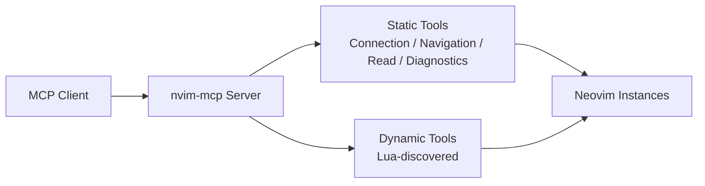

# Dev Plan: 移除 LSP Integration

## 0. 输入前置条件

### 输入前置条件表

| 类别 | 内容 | 是否已提供 | 备注 |
|------|------|------------|------|
| 仓库/模块 | `src/server/`、`src/neovim/`、`src/neovim/lua/`、`src/test_utils.rs`、`src/testdata/`、`docs/`、`README.md`、`ARCHITECTURE.md` | 是 | 已从仓库结构和文本检索确认主要影响面 |
| 目标接口 | `wait_for_lsp_ready` 与全部 `lsp_*` MCP 工具、Neovim LSP bridge、对应 Lua helper | 是 | 已确认为当前公开能力的一部分 |
| 运行环境 | Rust 2024、Lua、Neovim、MCP server、Nix dev 环境、`pre-commit`、`scripts/run-test.sh` | 是 | 已从仓库说明和记忆中确认 |
| 约束条件 | 保留非 LSP 功能；避免扩大到连接管理、导航、读取、诊断、动态 Lua 工具等无关能力 | 是 | 用户明确要求移除 LSP Integration |
| 已有测试 | `src/server/integration_tests.rs`、`src/neovim/integration_tests.rs`、`src/test_utils.rs` 中存在明显 LSP 相关测试/辅助逻辑 | 是 | 现有覆盖较多，需同步清理 |
| 需求来源 | 用户口头变更请求 | 是 | 本次计划基于当前对话生成 |

### 输入信息处理规则

- 已知信息：
  - 当前仓库存在完整的 LSP 工具面，包含 `wait_for_lsp_ready`、多个 `lsp_*` 工具、Neovim client 侧 LSP trait/实现、Lua helper、测试夹具与文档说明。
  - `ARCHITECTURE.md`、`README.md`、`docs/tools.md`、`docs/features-explained.md` 明确展示或宣传了 LSP Integration。
- 缺失信息：
  - 未明确是否要求保留历史文档中的 LSP 提及。
  - 未明确当前分支是否允许公开 API 破坏性变更。
  - 未明确是否需要同步调整版本号、变更日志或发布说明。
- 当前假设：
  - 本次改动允许对 MCP 工具面做破坏性收缩。
  - 目标是从实现、测试、文档三个层面移除 LSP Integration，而不仅是修改 `ARCHITECTURE.md`。
  - 非 LSP 的连接管理、缓冲区读取、导航、诊断、动态 Lua 工具保持不变。
- 若上述假设与实际不一致，必须在执行阶段将任务标记为 `[BLOCKED]`，并在风险项中升级处理。

---

## 1. 概览（Overview）

- 一句话目标：从 `nvim-mcp` 中移除全部 LSP Integration 能力，并同步清理实现、测试、文档与架构说明。
- 优先级：`[P1]`
- 预计时间：`6-8 小时`
- 当前状态：`[PLANNING]`
- 需求来源：用户要求“去掉 LSP Integration，我不需要这个功能”，并指定先产出 Dev Plan。
- 最终交付物：一套不再暴露 LSP MCP 工具的代码基线、更新后的测试与文档、以及移除 LSP 后一致的架构说明。

---

## 2. 背景与目标（Background & Goals）

### 2.1 为什么要做（Why）

当前项目把 LSP Integration 作为一组静态核心能力对外暴露，覆盖 hover、definition、rename、formatting、call hierarchy、type hierarchy 等场景。  
用户已明确不再需要该能力，这意味着继续维护这部分实现会带来额外复杂度、测试成本、文档噪音和环境依赖。

当前痛点：

- MCP 工具面过大，暴露了不再需要的 `lsp_*` 能力。
- `src/neovim/client.rs` 中存在较大体量的 LSP bridge 代码与 Lua helper 绑定。
- 集成测试和测试辅助逻辑显式依赖 LSP readiness，增加环境要求。
- 文档和架构图继续宣传已不需要的能力，造成认知偏差。

触发原因：

- 用户明确提出移除需求。

预期收益：

- 缩小公开工具面，降低维护成本。
- 降低测试环境对 LSP server 的依赖。
- 让架构文档与实际产品能力一致。
- 简化后续 Agent / Ralph 执行面，减少无关任务范围。

### 2.2 具体目标（What）

1. 移除 MCP 对外暴露的全部 `wait_for_lsp_ready` 与 `lsp_*` 工具。
2. 移除 Neovim client 中仅服务于 LSP Integration 的 trait、实现、配置字段与 Lua helper 引用。
3. 清理或改写所有依赖 LSP 的测试、测试辅助逻辑与仅用于 LSP 的测试夹具。
4. 更新 `ARCHITECTURE.md`、`README.md`、`docs/tools.md`、`docs/features-explained.md`，确保不再将 LSP Integration 作为产品能力描述。
5. 保证非 LSP 功能仍可构建、通过质量检查，并在工具面上保持可用。

### 2.3 范围边界、依赖与风险（Out of Scope / Dependencies / Risks）

| 类型 | 内容 | 说明 |
|------|------|------|
| Out of Scope | 重构连接管理、动态 Lua 工具机制 | 本次仅移除 LSP 能力，不改造无关架构 |
| Out of Scope | 新增替代能力 | 不新增其他静态工具来替代 `lsp_*` |
| Out of Scope | 版本发布、tag、changelog 流程 | 若需发版，另立任务 |
| Dependencies | `src/server/tools.rs` | 公开 MCP 工具定义与处理逻辑的核心入口 |
| Dependencies | `src/neovim/client.rs` | LSP trait 与 RPC/Lua bridge 的主要实现点 |
| Dependencies | `src/neovim/lua/lsp_*.lua` | LSP helper 脚本集合，需要核验后删除 |
| Dependencies | `src/server/integration_tests.rs`、`src/neovim/integration_tests.rs`、`src/test_utils.rs` | 存在显式 LSP 测试和等待逻辑 |
| Dependencies | `README.md`、`docs/tools.md`、`docs/features-explained.md`、`ARCHITECTURE.md` | 需要同步收缩产品说明 |
| Risks | 破坏外部调用方对 `lsp_*` 工具的依赖 | 属于预期 breaking change，需在文档中明确 |
| Risks | 误删通用 helper | 例如文档标识、通用参数结构、非 LSP 共享逻辑可能被 LSP 代码间接复用 |
| Risks | 测试夹具存在复用 | `src/testdata/` 中部分文件可能不只服务于 LSP 测试，删除前需核验引用 |
| Risks | 全量测试环境差异 | 本地/CI 的 Neovim 与语言服务器可用性不同，验证路径需明确 |
| Assumptions | `wait_for_lsp_ready` 与全部 `lsp_*` 工具都应彻底移除 | 若用户仅想删文档而非删实现，此假设失效 |
| Assumptions | LSP 文档历史记录无需保留 | 若需保留历史说明，应改为迁移到 changelog，而非继续保留在当前能力说明中 |
| Assumptions | 允许修改测试默认行为，去掉“默认等待 LSP”逻辑 | 否则测试辅助层会继续携带 LSP 假设 |

### 2.4 成功标准与验收映射（Success Criteria & Verification）

| 目标 | 验证方式 | 类型 | 通过判定 |
|------|----------|------|----------|
| 公开 MCP 工具面不再包含 LSP 能力 | `rg -n "wait_for_lsp_ready|lsp_" src/server README.md docs/tools.md ARCHITECTURE.md` | 自动 | 在公开工具与文档入口中无残留匹配 |
| Neovim client 不再包含 LSP bridge | `rg -n "async fn lsp_|include_str!\\(\"lua/lsp_|lsp_timeout_ms" src/neovim src/test_utils.rs` | 自动 | 无残留实现、Lua 引用和配置字段 |
| LSP Lua helper 已清理 | `rg --files src/neovim/lua | rg "/lsp_"` | 自动 | 无 `src/neovim/lua/lsp_*.lua` 文件残留 |
| 自动化测试不再依赖 LSP readiness | `rg -n "wait_for_lsp_ready|lsp_" src/server/integration_tests.rs src/neovim/integration_tests.rs src/test_utils.rs src/testdata` | 自动 | 无残留 LSP 测试逻辑，或仅保留经确认的非功能性文本 |
| 构建与质量门禁通过 | `cargo build`、`./scripts/run-test.sh -- --show-output`、`pre-commit run --all-files` | 自动 | 所有命令退出码为 0 |
| 文档与架构说明完成同步 | 人工审阅 `ARCHITECTURE.md`、`README.md`、`docs/tools.md`、`docs/features-explained.md` | 人工 | 不再出现“LSP Integration 是当前产品能力”的表述与图示 |

---

## 3. 技术方案（Technical Design）

### 3.1 高层架构

移除后的高层结构应收缩为“连接管理 + 读取/导航/诊断 + 动态 Lua 工具”，不再保留 Rust 静态 LSP 工具层。



说明：

- Rust 侧保留与 LSP 无关的静态工具。
- Neovim 仍作为底层编辑器连接目标存在。
- 不再存在 “Server -> LSP Server” 的能力链路与文档承诺。

### 3.2 核心流程

1. 盘点当前所有 `wait_for_lsp_ready`、`lsp_*` 工具入口、客户端方法、Lua helper、测试和文档引用。
2. 在 `src/server` 移除 LSP 相关 MCP 参数结构、处理函数、注册暴露和测试调用。
3. 在 `src/neovim` 移除 LSP trait 方法、实现、超时配置、Lua include 引用和对应脚本文件。
4. 调整测试辅助与测试夹具，去掉“默认等待 LSP”假设。
5. 更新 README、工具文档、架构文档和功能说明。
6. 通过构建、测试、lint、残留扫描完成收尾验证。

### 3.3 技术栈与运行依赖

- 语言 / 框架：
  - Rust 2024
  - Lua
  - MCP server
  - Neovim msgpack-rpc 集成
- 数据库：
  - 无
- 缓存 / 队列 / 中间件：
  - 无
- 第三方服务：
  - Neovim
  - 当前测试中涉及的语言服务器环境为移除对象，不再作为目标依赖保留
- 构建、测试、部署相关依赖：
  - `cargo build`
  - `./scripts/run-test.sh`
  - `pre-commit run --all-files`
  - `nix develop .`

### 3.4 关键技术点

- `[CORE]` MCP 工具面收缩必须同时覆盖工具定义、处理逻辑、参数结构和文档，否则会出现“代码删了但文档还在”或“文档删了但工具还在”。
- `[CORE]` `src/neovim/client.rs` 中 LSP trait 与实现体量较大，删除时必须防止误伤非 LSP 的读取、导航与缓冲区能力。
- `[NOTE]` `src/test_utils.rs` 当前存在默认等待 LSP 的测试辅助选项，需要去掉该默认假设。
- `[NOTE]` `src/testdata/` 中的 LSP 夹具删除前必须确认没有被非 LSP 测试复用。
- `[OPT]` 移除 LSP 后可进一步减少环境依赖和测试准备时间，但本次不主动做额外性能优化。
- `[COMPAT]` 这是对外工具面的 breaking change，必须在文档中同步体现。
- `[ROLLBACK]` 回滚时必须优先恢复“工具层 + client bridge + 测试”三者的一致性，禁止只恢复其中一层。

### 3.5 模块与文件改动设计

#### 模块级设计

- `src/server/`
  - 移除 LSP MCP 工具的参数定义、处理函数、注册暴露与相关集成测试。
  - 保留连接管理、导航、读取、诊断和动态工具路由。
- `src/neovim/`
  - 移除 `NeovimClientTrait` 与实现中的 LSP 方法、LSP 超时配置、Lua bridge 调用。
  - 保留非 LSP 的连接、读取、导航、诊断能力。
- `src/neovim/lua/`
  - 删除全部仅服务于 LSP 的 Lua helper 文件。
- `src/test_utils.rs` / `src/testdata/`
  - 去掉默认等待 LSP 的测试前置逻辑。
  - 清理仅用于 LSP 的夹具与测试样例。
- `docs/`、`README.md`、`ARCHITECTURE.md`
  - 更新功能列表、工具文档、架构图与能力说明。

#### 文件级改动清单

| 类型 | 路径 | 说明 |
|------|------|------|
| 新增 | 无 | 本次以删除和修改为主 |
| 修改 | `src/server/tools.rs` | 删除 `wait_for_lsp_ready` 与全部 `lsp_*` 工具定义/处理逻辑 |
| 修改 | `src/neovim/client.rs` | 删除 LSP trait、实现、Lua bridge、配置字段 |
| 修改 | `src/test_utils.rs` | 去掉默认等待 LSP 的测试辅助逻辑 |
| 修改 | `src/server/integration_tests.rs` | 删除或改写 LSP MCP 工具测试 |
| 修改 | `src/neovim/integration_tests.rs` | 删除或改写 Neovim client 侧 LSP 测试 |
| 修改 | `src/testdata/` | 核验并清理仅用于 LSP 的测试夹具 |
| 修改 | `README.md` | 删除功能宣传中的 LSP Integration 描述 |
| 修改 | `docs/tools.md` | 删除 LSP Integration 章节与工具参数说明 |
| 修改 | `docs/features-explained.md` | 删除或改写涉及 LSP 的能力说明与图示 |
| 修改 | `ARCHITECTURE.md` | 去掉 LSP Integration 与相关流程/图示 |
| 修改 | `Cargo.toml` | 若移除后出现未使用的 LSP 相关依赖，则同步清理 |
| 修改 | `Cargo.lock` | 若依赖变化，则同步更新锁文件 |
| 删除 | `src/neovim/lua/lsp_*.lua` | 删除全部 LSP helper 脚本 |
| 删除 | `src/testdata/cfg_lsp.lua` | 若确认仅服务于 LSP 测试则删除 |

### 3.6 边界情况与异常处理

- 旧调用方仍尝试调用 `lsp_*` 工具：
  - 预期行为是工具不存在或调用失败。
  - 文档必须同步说明工具面已收缩。
- 删除 `src/neovim/lua/lsp_*.lua` 后仍有 `include_str!` 或测试引用：
  - 构建应立即失败，属于必须修复的问题。
- `src/testdata/` 夹具被非 LSP 测试间接使用：
  - 不得直接删除；需先改写测试引用或保留夹具并记录原因。
- `DocumentIdentifier`、读取/导航工具与 LSP helper 存在共享辅助逻辑：
  - 必须先确认共享边界，避免误删通用代码。
- 全量测试环境不具备 Neovim/LSP：
  - 本次目标是“测试不再依赖 LSP”；若仍因 LSP 缺失失败，视为未达标。
- 文档残留“LSP Integration”：
  - 视为交付不完整，不得标记完成。

### 3.7 测试策略

- 单元测试：
  - 若 `src/server/tools.rs` 或 `src/neovim/client.rs` 内存在与 LSP 解绑后需要调整的纯逻辑测试，应同步更新。
- 集成测试：
  - 删除或改写 `src/server/integration_tests.rs`、`src/neovim/integration_tests.rs` 中所有 LSP 相关 case。
  - 保证非 LSP 集成测试仍通过。
- 回归测试：
  - 对连接管理、导航、读取、诊断、动态 Lua 工具执行回归，确认无 LSP 代码删除引发的副作用。
- lint / typecheck / build：
  - 至少运行 `cargo build`、`./scripts/run-test.sh -- --show-output`、`pre-commit run --all-files`。
- 必要的人工验证：
  - 人工检查 `ARCHITECTURE.md`、`README.md`、`docs/tools.md` 的公开能力说明是否一致。
- 需要新增的测试：
  - 原则上不新增 LSP 替代测试；如删除 LSP 后暴露出非 LSP 功能的测试空洞，仅补最小必要覆盖。
- 需要修改的测试：
  - 所有引用 `wait_for_lsp_ready` 或 `lsp_*` 的测试与辅助逻辑。
- 必须保持通过的现有测试：
  - 所有非 LSP 相关测试、构建、lint、文档检查。

---

## 4. 实施计划（Implementation Plan）

### 4.1 执行基本原则（强制）

1. 所有任务必须可客观验证。
2. 任务必须单一目的、可回滚、影响面可控。
3. Task N 未验证通过，禁止进入 Task N+1。
4. 失败必须记录原因和处理路径，禁止死循环。
5. 禁止通过弱化断言、硬编码结果、跳过校验来“伪完成”。

### 4.2 分阶段实施

#### 阶段 1：准备与基线确认

- 阶段目标：确认 LSP 能力的完整影响面，并建立移除前基线。
- 预计时间：`0.5-1 小时`
- 交付物：影响面清单、基线验证结果、明确的删除边界。
- 进入条件：仓库可读，需求与假设已记录。
- 完成条件：已确认 `src/server`、`src/neovim`、测试、文档四个层面的 LSP 残留范围，并完成一次基线构建/扫描。

#### 阶段 2：核心实现

- 阶段目标：移除 Rust 侧 MCP LSP 工具与 Neovim client LSP bridge。
- 预计时间：`3-4 小时`
- 交付物：不再暴露 `wait_for_lsp_ready` / `lsp_*` 的代码基线。
- 进入条件：阶段 1 已完成并验证通过。
- 完成条件：Server 层与 client 层已无 LSP 工具实现和 Lua 引用残留。

#### 阶段 3：测试与验证

- 阶段目标：清理测试与夹具，完成自动化验证。
- 预计时间：`1.5-2 小时`
- 交付物：更新后的测试基线、通过的构建与测试结果。
- 进入条件：阶段 2 已完成并验证通过。
- 完成条件：测试不再依赖 LSP readiness，自动化验证通过。

#### 阶段 4：收尾与完成确认

- 阶段目标：同步文档、架构说明、最终残留扫描和 DoD 对齐。
- 预计时间：`0.5-1 小时`
- 交付物：一致的文档与最终完成确认记录。
- 进入条件：阶段 3 已完成并验证通过。
- 完成条件：文档一致、无未记录 blocker、DoD 全部满足。

### 4.3 Task 列表

#### Task 1: 盘点 LSP 影响面并建立基线

| 项目 | 内容 |
|------|------|
| 目标 | 明确所有 `wait_for_lsp_ready`、`lsp_*`、LSP helper、LSP 测试和文档入口 |
| 代码范围 | `src/server/`、`src/neovim/`、`src/test_utils.rs`、`src/testdata/`、`docs/`、`README.md`、`ARCHITECTURE.md` |
| 预期改动 | 不改代码；仅形成基线与删除边界 |
| 前置条件 | 当前假设已记录；仓库可构建 |
| 输出产物 | LSP 影响面清单、基线命令结果、删除边界说明 |
| 当前状态 | `[TODO]` |

**验证命令 / 检查方式**：

```bash
rg -n "wait_for_lsp_ready|lsp_|LSP Integration|LSP" src README.md docs ARCHITECTURE.md
cargo build
./scripts/run-test.sh -- --skip=integration_tests --show-output
```

**通过判定**：

- [PASS] 已输出明确影响面，且基线构建成功。
- [PASS] 若基线测试失败，已定位是否为既有失败，并在计划执行记录中注明。

**失败处理**：

- 失败后先确认失败是否由现有环境或既有问题导致。
- 最多允许 2 次重试修复命令或环境问题。
- 超过阈值后升级为阻塞，并记录“基线不可用”。

**门禁规则**：

- [BLOCK] 未形成完整影响面清单或基线不可解释前，禁止进入 Task 2。

#### Task 2: 移除 Server 层 LSP MCP 工具定义与处理逻辑

| 项目 | 内容 |
|------|------|
| 目标 | 删除 `src/server/tools.rs` 中 `wait_for_lsp_ready` 与全部 `lsp_*` 工具的参数定义、处理函数、对外暴露与相关引用 |
| 代码范围 | `src/server/tools.rs` 及必要的 `src/server/` 注册入口 |
| 预期改动 | 减少公开工具面；保留非 LSP 静态工具 |
| 前置条件 | Task 1 已通过并确认删除边界 |
| 输出产物 | 不再包含 LSP MCP 工具的 Server 层实现 |
| 当前状态 | `[TODO]` |

**验证命令 / 检查方式**：

```bash
cargo build
rg -n "wait_for_lsp_ready|pub async fn lsp_|lsp_client_name" src/server
```

**通过判定**：

- [PASS] `src/server` 不再包含 LSP MCP 工具处理入口。
- [PASS] `cargo build` 通过，且无新的未解析引用。

**失败处理**：

- 失败后先修复工具注册与引用不一致问题。
- 最多允许 2 次修复重试。
- 超过阈值后升级为阻塞，并回到 Task 1 重新确认影响面。

**门禁规则**：

- [BLOCK] Server 层仍暴露任何 LSP 工具时，禁止进入 Task 3。

#### Task 3: 移除 Neovim client LSP bridge 与 Lua helper

| 项目 | 内容 |
|------|------|
| 目标 | 删除 `src/neovim/client.rs` 中所有 LSP trait/实现、超时配置与 `src/neovim/lua/lsp_*.lua` helper |
| 代码范围 | `src/neovim/client.rs`、`src/neovim/lua/`、必要时 `Cargo.toml` / `Cargo.lock` |
| 预期改动 | 彻底去除 client 侧 LSP bridge，同时保留非 LSP 能力 |
| 前置条件 | Task 2 已通过 |
| 输出产物 | 无 LSP trait、无 LSP Lua 引用、无多余依赖残留 |
| 当前状态 | `[TODO]` |

**验证命令 / 检查方式**：

```bash
cargo build
rg -n "async fn lsp_|include_str!\\(\"lua/lsp_|lsp_timeout_ms" src/neovim src/test_utils.rs
rg --files src/neovim/lua | rg "/lsp_"
```

**通过判定**：

- [PASS] `src/neovim` 与 `src/neovim/lua/` 中无 LSP bridge 与 helper 残留。
- [PASS] `cargo build` 通过。
- [PASS] 若移除依赖，锁文件与依赖图已同步。

**失败处理**：

- 失败后优先排查误删的共享逻辑和残留引用。
- 最多允许 2 次修复重试。
- 超过阈值后升级为阻塞，并拆分“共享逻辑保留/纯 LSP 删除”边界重新处理。

**门禁规则**：

- [BLOCK] client 层仍存在 LSP 方法或 Lua helper 残留时，禁止进入 Task 4。

#### Task 4: 清理测试、测试辅助与 LSP 专项夹具

| 项目 | 内容 |
|------|------|
| 目标 | 删除或改写所有依赖 LSP 的测试、`wait_for_lsp_ready` 测试辅助逻辑和仅服务于 LSP 的夹具 |
| 代码范围 | `src/server/integration_tests.rs`、`src/neovim/integration_tests.rs`、`src/test_utils.rs`、`src/testdata/` |
| 预期改动 | 测试体系不再要求 LSP server 可用 |
| 前置条件 | Task 3 已通过 |
| 输出产物 | 更新后的测试与夹具基线 |
| 当前状态 | `[TODO]` |

**验证命令 / 检查方式**：

```bash
rg -n "wait_for_lsp_ready|lsp_" src/server/integration_tests.rs src/neovim/integration_tests.rs src/test_utils.rs src/testdata
cargo test
```

**通过判定**：

- [PASS] 测试与辅助逻辑中无 LSP 残留，或已对保留项给出明确理由。
- [PASS] `cargo test` 通过。
- [PASS] 非 LSP 测试不因删除 LSP 功能而回归失败。

**失败处理**：

- 失败后先定位是测试残留、夹具复用还是非 LSP 回归。
- 最多允许 2 次修复重试。
- 超过阈值后升级为阻塞，并记录具体失败用例和文件路径。

**门禁规则**：

- [BLOCK] 测试层仍依赖 LSP readiness 时，禁止进入 Task 5。

#### Task 5: 更新文档与架构说明

| 项目 | 内容 |
|------|------|
| 目标 | 让 README、工具文档、功能说明、架构图与当前代码能力一致，不再展示 LSP Integration |
| 代码范围 | `README.md`、`docs/tools.md`、`docs/features-explained.md`、`ARCHITECTURE.md` |
| 预期改动 | 删除 LSP 章节、更新工具列表、重绘架构描述 |
| 前置条件 | Task 4 已通过 |
| 输出产物 | 与实际产品能力一致的文档基线 |
| 当前状态 | `[TODO]` |

**验证命令 / 检查方式**：

```bash
rg -n "LSP Integration|wait_for_lsp_ready|lsp_" README.md docs ARCHITECTURE.md
```

**通过判定**：

- [PASS] 目标文档中不再把 LSP 作为当前产品能力说明。
- [PASS] `ARCHITECTURE.md` 中已去除 LSP Integration 相关图示与流程描述。

**失败处理**：

- 失败后先按“公开入口优先”顺序修复 README、工具文档、架构文档。
- 最多允许 2 次修复重试。
- 超过阈值后升级为阻塞，并记录残留文档位置。

**门禁规则**：

- [BLOCK] 文档仍与代码能力不一致时，禁止进入 Task 6。

#### Task 6: 执行全量质量门禁与残留扫描

| 项目 | 内容 |
|------|------|
| 目标 | 通过构建、测试、lint、文档检查和残留扫描完成最终自动化验证 |
| 代码范围 | 全仓库 |
| 预期改动 | 无功能改动；只允许最小修复以通过门禁 |
| 前置条件 | Task 5 已通过 |
| 输出产物 | 可归档的验证结果 |
| 当前状态 | `[TODO]` |

**验证命令 / 检查方式**：

```bash
cargo build
./scripts/run-test.sh -- --show-output
pre-commit run --all-files
rg -n "wait_for_lsp_ready|lsp_|LSP Integration" src README.md docs ARCHITECTURE.md
```

**通过判定**：

- [PASS] 所有命令退出码为 0。
- [PASS] 仓库内不再存在未预期的 LSP Integration 残留。
- [PASS] 若存在保留文本，已明确为非功能性历史内容并经人工批准。

**失败处理**：

- 失败后先收敛到最近一次通过点，逐项修复，不允许扩大重构。
- 最多允许 3 次修复重试。
- 超过阈值后升级为阻塞，并停止继续推进。

**门禁规则**：

- [BLOCK] 任一质量门禁未通过，禁止进入 Task 7。

#### Task 7: 完成确认与交付收口

| 项目 | 内容 |
|------|------|
| 目标 | 对照成功标准、DoD、风险和状态机完成最终收口 |
| 代码范围 | 全仓库与计划文档状态 |
| 预期改动 | 更新状态；补齐 blocker、假设与验证结果记录 |
| 前置条件 | Task 6 已通过 |
| 输出产物 | 最终完成记录与可交付结果 |
| 当前状态 | `[TODO]` |

**验证命令 / 检查方式**：

```bash
# 人工检查点
# 1. 对照“成功标准与验收映射”逐项核对
# 2. 对照“最终完成条件”逐项核对
# 3. 确认所有 Task 状态已更新且无未记录 blocker
```

**通过判定**：

- [PASS] 所有 Task 已验证通过并更新状态。
- [PASS] 成功标准、DoD、风险记录和交付物彼此一致。
- [PASS] 无未记录 blocker、无未解释的例外保留。

**失败处理**：

- 失败后先补齐缺失的状态、验证记录或 blocker 记录。
- 最多允许 2 次修复重试。
- 超过阈值后升级为阻塞，并暂停交付。

**门禁规则**：

- [BLOCK] 未完成状态收口与 DoD 核对前，禁止宣告完成。

---

## 5. 失败处理协议（Error-Handling Protocol）

| 级别 | 触发条件 | 处理策略 |
|------|----------|----------|
| Level 1 | 单次验证失败 | 原地修复，禁止扩大重构 |
| Level 2 | 连续 3 次失败 | 回到假设和接口定义，重新核对输入输出 |
| Level 3 | 仍无法通过 | 停止执行，记录 Blocker，等待人工确认 |

### 重试规则

- 每次修复必须记录变更范围。
- 每次重试前必须更新状态。
- 同一类失败不得无限重复。
- 达到阈值必须升级，不得原地空转。

---

## 6. 状态同步机制（Stateful Plan）

这份 Plan 不是静态文档，而是执行状态机。

### 状态标记规范

| 标记 | 含义 |
|------|------|
| [TODO] | 未开始 |
| [DOING] | 进行中 |
| [DONE] | 已完成且验证通过 |
| [BLOCKED] | 阻塞 |
| [PASS] | 当前验证通过 |
| [FAIL] | 当前验证失败 |

### 强制要求

- 每一轮执行必须更新状态。
- 未验证通过前禁止标记 `[DONE]`。
- 遇到问题必须记录失败原因和阻塞点。
- 若阶段完成，必须同步更新阶段状态。

---

## 7. Anti-Patterns（禁止行为）

- `[FORBIDDEN]` 禁止删除或弱化现有断言
- `[FORBIDDEN]` 禁止为了通过测试而硬编码返回值
- `[FORBIDDEN]` 禁止跳过验证步骤
- `[FORBIDDEN]` 禁止引入未声明依赖
- `[FORBIDDEN]` 禁止关闭 lint / typecheck / 类型检查以规避问题
- `[FORBIDDEN]` 禁止修改超出范围的模块
- `[FORBIDDEN]` 禁止在未记录原因的情况下扩大重构范围

违反后的动作：

- Task 标记为 `[BLOCKED]`
- 必须回滚到最近一个验证通过点
- 必须记录触发原因

---

## 8. 最终完成条件（Definition of Done）

- 所有计划内 Task 已完成。
- 所有关键验证已通过。
- 没有未记录的 blocker。
- 约束条件仍被满足。
- 交付物已齐备。
- 成功标准与验收映射表中的项目全部完成。
- 公开工具面、实现层、测试层、文档层均已完成 LSP Integration 移除。
- `ARCHITECTURE.md` 已去掉 LSP Integration，并与实际代码能力一致。

---

## 9. 质量检查清单

- [x] 所有目标都有验证方式
- [x] 所有 Task 都有验证方式
- [x] 所有 Task 都具备原子性和可回滚性
- [x] 已明确 Out of Scope
- [x] 已明确依赖与风险
- [x] 已明确文件级改动范围
- [x] 已定义失败处理协议
- [x] 已定义 Anti-Patterns
- [x] 已定义最终完成条件
- [x] 当前 Plan 可被 Agent 连续执行
- [x] 当前结构可转换为 Ralph Spec
