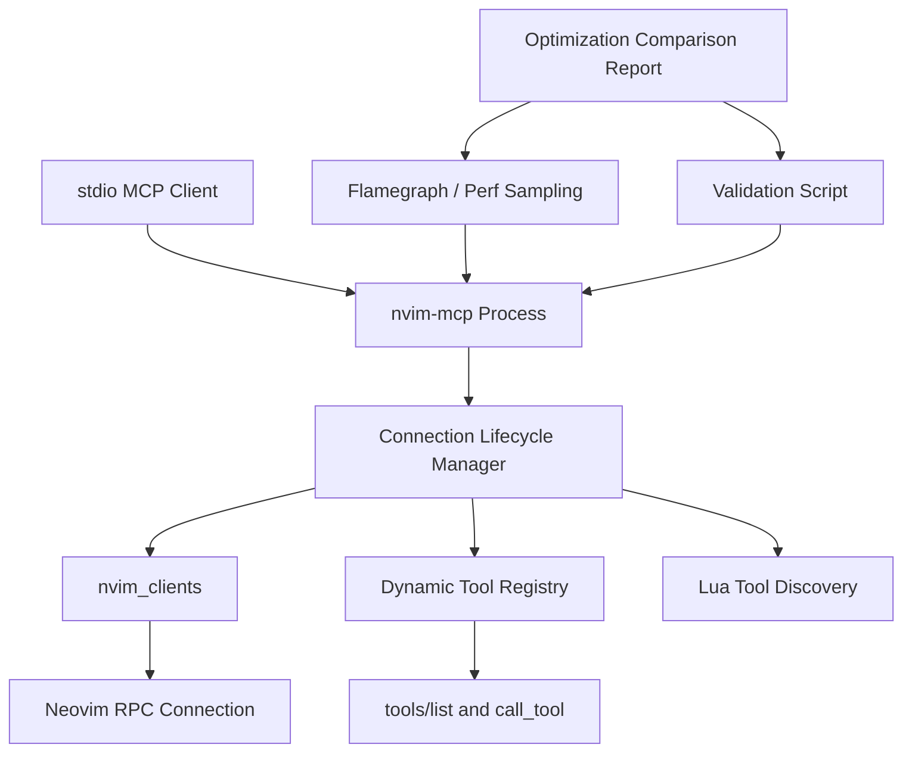

| 类别 | 内容 | 是否已提供 | 备注 |
|------|------|------------|------|
| 仓库/模块 | `src/main.rs`、`src/server/core.rs`、`src/server/tools.rs`、`src/server/hybrid_router.rs`、`src/server/resources.rs`、`src/server/lua_tools.rs`、`src/neovim/client.rs`、`scripts/measure_connected_mcp_memory.py`、`docs/usage.md`、`docs/mcp-memory-optimization-report-zh.md` | 是 | 相关热点模块和报告路径已明确 |
| 目标接口 | `stdio` 模式启动、`--connect auto`、`connect`/`disconnect`、`tools/list`、动态 Lua tools 注册与清理、性能校验脚本、flamegraph 采样流程 | 是 | 以 MCP server 生命周期、热点定位和验收闭环为主 |
| 运行环境 | Rust 2024、Cargo、Tokio、rmcp、DashMap、Neovim、Python3 校验脚本、可选 `nix develop .`、`cargo flamegraph` | 是 | 已确认 `cargo flamegraph` 可用；`perf` 不可用但不是阻塞项 |
| 约束条件 | 保持 `stdio` 模式；不切换到 HTTP 共享 daemon；不破坏现有 MCP 工具语义；兼容 `--connect auto`；优化必须可被现有脚本验证；本轮不引入 idle cleanup / TTL | 是 | 本计划聚焦 stdio 内部优化与可验证收益 |
| 已有测试 | `src/server/integration_tests.rs`、`src/neovim/integration_tests.rs`、`./scripts/run-test.sh`、`scripts/measure_connected_mcp_memory.py` 校验脚本 | 是 | 现有脚本已能产出基线数据，需增强覆盖面 |
| 需求来源 | 用户口头需求 + [docs/mcp-memory-optimization-report-zh.md](/Users/pittcat/Dev/Rust/nvim-mcp/docs/mcp-memory-optimization-report-zh.md) + 当前已有校验脚本与测量数据 | 是 | 本计划基于 2026-03-15 上下文生成 |

### 已知信息

- 当前 `stdio` 模式下，多个 Claude Code 会话会各自启动独立 `nvim-mcp` 进程，跨进程无法共享连接表和动态工具注册表。
- 现有 3-client 最小真实 `stdio` 握手基线约为 `22.69 MiB`，单进程约 `7.47-7.61 MiB`。
- 用户已给出优化目标：`保底 10%`，`争取 20%`。
- 现有校验脚本 `scripts/measure_connected_mcp_memory.py` 和现有 JSON 数据已经存在，可以直接用于优化前后对比。
- 用户日常配置通常包含 `--connect auto --log-file ./nvim-mcp.log --log-level debug`，但现有校验脚本尚未覆盖完整日常运行态。
- `src/server/hybrid_router.rs` 当前同时维护 `dynamic_tools` 和 `connection_tools` 两层索引，存在重复字符串和集合元数据开销。
- `src/server/tools.rs` 的 `disconnect` 当前直接从 `nvim_clients` 删除连接并断开 Neovim，但没有在同一路径中显式清理动态工具注册表。
- 当前还没有纳入正式工作流的 flamegraph 基线，因此热点判断仍偏结构推断。

### 缺失信息

- 无。

### 当前假设

- 本轮优化只针对 `stdio` 模式内部生命周期和内存结构，不引入共享 daemon。
- 本轮不实现 idle cleanup / TTL，避免影响长会话下的连接可用性。
- 优化优先级由 flamegraph 热点和现有校验脚本的基线数据共同决定，而不是单纯凭代码直觉。
- 验收以“热点已定位 + 优化已落地 + 校验脚本证明有效 + 有最终对比报告”为主，RSS 目标按“保底 10%，争取 20%”执行。
- 接受轻量级运行时统计暴露，但范围仅限 `debug/resource/测试`，不作为面向普通用户的正式功能。

# Dev Plan: stdio 内存与性能优化

## 1. 概览（Overview）

- 一句话目标：在保持 `stdio` 模式和现有 MCP 语义不变的前提下，基于 flamegraph 与现有校验脚本定位并落地 `nvim-mcp` 性能/内存优化，并输出优化前后对比报告。
- 优先级：`[P0]`
- 预计时间：3.0 至 5.0 人日
- 当前状态：`[PLANNING]`
- 需求来源：用户口头需求 + [docs/mcp-memory-optimization-report-zh.md](/Users/pittcat/Dev/Rust/nvim-mcp/docs/mcp-memory-optimization-report-zh.md) + 当前已有校验脚本与测量结果
- 最终交付物：一组经过验证的 `stdio` 性能与内存优化实现、回归测试、增强后的校验脚本、优化前后 flamegraph、优化前后对比报告、更新后的使用与验证文档

## 2. 背景与目标（Background & Goals）

### 2.1 为什么要做（Why）

当前 `stdio` 模式的主要问题不是单次调用成本，而是“每个客户端一个 `nvim-mcp` 进程”带来的重复常驻开销。但如果要做性能优化，不能只凭结构猜测，而要把“热点定位 -> 实现优化 -> 校验证明 -> 报告沉淀”串起来。基于当前上下文，仓库内部至少存在四个可优化点：

1. 连接断开、目标切换、自动连接替换时的清理路径不够集中，容易遗留动态工具和相关状态。
2. 动态工具注册表采用双索引结构，存在重复字符串、`HashSet`、`DashMap` 元数据开销。
3. 现有校验脚本虽然已经能产出数据，但还没有和热点分析、场景分层、优化回归形成闭环。
4. 当前缺少 flamegraph 基线，无法明确判断热点到底是在连接生命周期、动态工具注册、`tools/list` 生成、还是其他路径。

当前痛点：

- 多个 `stdio` 会话并发时，RSS 近似线性叠加。
- 生命周期清理不完整会放大“每个进程的常驻开销”。
- 没有 flamegraph 和统一对比报告时，优化前后容易各说各话。

触发原因：

- 用户明确关心“如果继续用 `stdio`，还能怎么做内存优化”。
- 用户明确要求把火焰图纳入计划，把现有校验脚本作为优化验收主线，并在代码完成后输出优化前后对比报告。
- 报告已证明共享 daemon 虽然更强，但不属于这次 `stdio` 约束内的解法。

预期收益：

- 消除连接替换和断开后的动态工具残留。
- 降低每个 `stdio` 进程的连接态元数据占用。
- 建立“火焰图定位 + 校验脚本验收 + 报告对比”的性能优化闭环。

### 2.2 具体目标（What）

1. 统一 `stdio` 模式下的连接清理路径，确保连接移除后关联动态工具和连接状态可回收。
2. 压缩动态工具注册结构，减少重复索引和重复字符串带来的常驻内存。
3. 把 flamegraph 分析纳入正式执行流程，至少形成一组优化前热点与优化后复核结果。
4. 以现有 `scripts/measure_connected_mcp_memory.py` 为核心验收脚本，补齐 `--connect auto` 和重复 connect/disconnect 场景的测量能力。
5. 在代码完成后产出一份优化前后对比报告，明确“优化了什么、如何验证、优化了多少、剩余瓶颈是什么”。
6. 保持现有 MCP 工具行为、连接语义和主要集成测试通过，不引入功能回退。

### 2.3 范围边界、依赖与风险（Out of Scope / Dependencies / Risks）

| 类型 | 内容 | 说明 |
|------|------|------|
| Out of Scope | 切换到 HTTP/daemon 共享进程模式 | 这属于更高杠杆的架构优化，但不在本次 `stdio` 约束内 |
| Out of Scope | 重写全部动态工具系统或 Lua 插件协议 | 本轮只做生命周期、热点路径和存储结构收敛 |
| Out of Scope | idle cleanup / TTL 自动断开能力 | 用户明确不希望本轮引入，以免影响长会话再次使用时的连接体验 |
| Out of Scope | 追求特定平台上的极限 RSS 数值 | 当前以相对下降、无泄漏和有证据的热点优化为主 |
| Dependencies | `rmcp` 工具路由、Tokio runtime、DashMap、Neovim 连接层、Lua tool 发现逻辑 | 优化必须与现有协议和工具调用兼容 |
| Dependencies | 现有测试基础设施：`./scripts/run-test.sh`、headless Neovim、Python3 校验脚本 | 验证需要这些环境可用 |
| Dependencies | flamegraph/perf 工具链 | 需要用来定位优化前后的热点路径 |
| Risks | `disconnect`/替换路径调整可能误删仍在使用的动态工具 | 需要精确绑定 `connection_id` 生命周期 |
| Risks | 压缩注册结构可能改变 `tools/list` 和连接级工具查询行为 | 必须用回归测试锁定工具可见性语义 |
| Risks | RSS 噪声较大，绝对值容易受系统状态影响 | 采用重复运行与相对判定，不只看单次值 |
| Risks | flamegraph 采样工具缺失或采样噪声过大 | 需要预先确认工具链，必要时退回到平台等价工具 |
| Assumptions | `stdio` 每客户端一进程的模型保持不变 | 本轮不尝试跨进程共享 |
| Assumptions | 用户接受先做“热点定位 + 清理 + 结构收敛 + 基线增强”的分阶段优化 | 这是当前最稳妥的 `stdio` 路线 |
| Assumptions | 轻量运行时统计暴露可用于调试和验证 | 已确认接受，但范围仅限 `debug/resource/测试` |
| Assumptions | 最终报告使用中文 Markdown，作为人类审阅与后续 Agent 交接材料 | 符合当前用户要求 |

### 2.4 成功标准与验收映射（Success Criteria & Verification）

| 目标 | 验证方式 | 类型 | 通过判定 |
|------|----------|------|----------|
| 连接断开后无动态工具残留 | `cargo test test_end_to_end_lua_tools_workflow -- --nocapture` + 新增断言 | 自动 | 断开后连接级动态工具查询为空，后续调用返回预期错误 |
| 目标替换/重复连接无状态泄漏 | 新增连接替换与重复 connect/disconnect 回归测试 | 自动 | 重复 10 次后连接计数和动态工具计数回到基线 |
| 已形成可操作的热点分析结果 | 运行 flamegraph 命令并留存 SVG/截图/分析结论 | 自动 + 人工 | 能指出至少 1 个主要热点路径，并能映射到具体代码区域 |
| 动态工具注册结构内存更紧凑 | 现有校验脚本 + 新增场景参数，对比优化前后 RSS | 自动 | 同等场景下 RSS 至少下降 10%，理想目标为 20%；若未达标必须在报告中解释 |
| `--connect auto` 场景可被重复测量 | 增强 `scripts/measure_connected_mcp_memory.py` 支持 server args/场景循环 | 自动 | 能执行带 `--connect auto` 的命令并生成 JSON 结果 |
| 功能无回退 | `./scripts/run-test.sh -- --show-output` | 自动 | 测试套件通过，无新增失败 |
| 已产出优化前后对比报告 | 人工审阅优化报告 Markdown | 人工 | 报告中包含基线、热点、改动点、验收数据、收益结论、剩余问题 |
| 文档与计划可指导后续执行 | 人工审阅 [dev_plan_stdio-memory-optimization.md](/Users/pittcat/Dev/Rust/nvim-mcp/dev_plan_stdio-memory-optimization.md) 与更新后的 usage/docs | 人工 | 计划、风险、验证步骤完整且无明显自相矛盾 |

## 3. 技术方案（Technical Design）

### 3.1 高层架构



设计说明：

- `stdio` 每客户端一进程这一点不变，优化重点放在单进程内部。
- flamegraph 负责定位热点，校验脚本负责证明收益，对比报告负责沉淀结论。
- 把“连接建立、连接替换、连接断开”统一抽象为同一套生命周期管理入口。
- 动态工具注册表从“可工作但有重复开销”的结构收敛成“更少重复索引、更好清理、更易统计”的结构。
- 校验脚本补齐场景参数，使优化前后对比不再只看最小握手基线。

### 3.2 核心流程

```text
1. 用 flamegraph 或等价采样工具采集优化前热点
2. 用现有校验脚本采集优化前基线数据
3. stdio client 启动 nvim-mcp
4. nvim-mcp 根据 connect 行为建立/恢复连接
5. 生命周期管理器登记连接元数据
6. 仅在需要时发现并注册 Lua dynamic tools
7. tools/list / call_tool 使用紧凑注册表读取工具信息
8. disconnect / target replacement 进入统一 teardown
9. teardown 依次执行：
   - 停止 Neovim RPC 连接
   - 注销 dynamic tools
   - 清理连接索引与统计
   - 如有需要，通知 tool list changed
10. 再次运行 flamegraph 和校验脚本
11. 输出优化前后对比报告
```

### 3.3 技术栈与运行依赖

- 语言 / 框架：Rust 2024、Tokio、rmcp
- 数据库：无
- 缓存 / 队列 / 中间件：无外部中间件；进程内使用 `DashMap` 和 Tokio task
- 第三方服务：Neovim RPC、Lua 插件导出的动态工具
- 构建、测试、部署相关依赖：Cargo、`./scripts/run-test.sh`、Python3、headless Neovim、可选 `nix develop .`、`cargo flamegraph` 或等价采样工具

### 3.4 关键技术点

- `[CORE]` 把连接 teardown 收敛成单一路径，覆盖手动 `disconnect`、自动连接替换、启动失败回滚。
- `[CORE]` 重构 `dynamic_tools` / `connection_tools` 结构，减少重复 `tool_name` 和集合开销，同时保持 `tools/list` 与 `call_tool` 语义稳定。
- `[CORE]` 把 flamegraph 纳入正式流程，用热点证据而不是猜测驱动优化优先级。
- `[CORE]` 为 `--connect auto` 场景提供可重复测量路径，避免只凭最小基线判断优化效果。
- `[CORE]` 以现有校验脚本作为优化验收主线，所有收益结论必须能回落到脚本结果。
- `[NOTE]` `tool_list_changed` 通知必须与真实注册表状态一致，避免客户端缓存脏数据。
- `[NOTE]` flamegraph 只用于定位热点，不可替代回归测试和校验脚本的定量验收。
- `[OPT]` 可选引入共享元数据或延迟 materialize `Tool` schema，减少 `tools/list` 期间的瞬时分配。
- `[OPT]` 视读写比例评估是否继续使用 `DashMap`，但这不是第一阶段必须项。
- `[COMPAT]` 保持现有静态工具名、动态工具调用方式和 `connection_id` 语义不变。
- `[ROLLBACK]` 若注册结构重构导致工具可见性异常，应优先回滚到“只修 teardown + 不改存储结构”的安全版本。

### 3.5 模块与文件改动设计

#### 模块级设计

- 启动与连接行为模块：梳理 `stdio` 启动后 `manual/auto/specific target` 三种行为的清理边界。
- 连接生命周期模块：集中处理连接添加、替换、断开。
- 动态工具路由模块：压缩注册结构，保证按连接查询和按工具名列举都能高效且可清理。
- 资源与可观测性模块：提供调试所需的统计信息，支撑测试和校验脚本判定。
- 性能分析模块：采集 flamegraph 并把热点映射到具体代码路径。
- 测量与文档模块：让优化有明确基线、命令、结果记录和最终对比报告。

#### 文件级改动清单

| 类型 | 路径 | 说明 |
|------|------|------|
| 修改 | `src/server/core.rs` | 抽取统一的连接注册/清理入口，覆盖自动连接、替换和 teardown |
| 修改 | `src/server/tools.rs` | 让 `disconnect` 走统一 teardown，并同步清理动态工具与通知 |
| 修改 | `src/server/hybrid_router.rs` | 重构动态工具存储结构，减少重复索引并保持查询语义 |
| 修改 | `src/server/resources.rs` | 暴露更适合调试和测试的连接/动态工具统计信息 |
| 修改 | `src/server/lua_tools.rs` | 调整发现与注册时机，避免无效注册或残留 |
| 修改 | `src/main.rs` | 如需调整连接生命周期相关配置或调试参数，在这里补启动 wiring |
| 修改 | `src/neovim/client.rs` | 如 teardown 或运行时统计需要底层辅助接口，在这里补齐 |
| 修改 | `src/server/integration_tests.rs` | 新增/修改 disconnect、替换、重复连接、动态工具清理回归测试 |
| 修改 | `src/neovim/integration_tests.rs` | 补连接生命周期边界测试，确保底层 disconnect 行为稳定 |
| 修改 | `scripts/measure_connected_mcp_memory.py` | 支持 server args、循环场景、可选 `--connect auto` 测量 |
| 修改 | `docs/usage.md` | 记录 stdio 性能优化行为、flamegraph 与校验命令 |
| 修改 | `docs/mcp-memory-optimization-report-zh.md` | 追加优化结果与新的验证口径 |
| 新增 | `docs/perf/stdio-memory-optimization-comparison-report-zh.md` | 记录优化前后 flamegraph、校验结果、收益与剩余瓶颈 |
| 新增 | `docs/plans/2026-03-15-stdio-memory-optimization-notes.md` | 可选：记录实施期基线和决策依据 |

### 3.6 边界情况与异常处理

- 空连接断开：对不存在的 `connection_id` 仍返回明确错误，不得静默成功。
- 自动连接替换：旧目标断开失败时，必须记录警告并继续清理注册表，避免半残留状态。
- Lua tool 发现失败：不能让整个 server 崩溃，但必须避免把失败连接标记为“已注册工具”。
- 重复注册同名动态工具：必须继续按 `connection_id` 精确隔离，不得互相覆盖。
- `tools/list` 与 teardown 并发：不得返回已断开连接的工具定义或触发悬挂引用。
- benchmark 噪声：必须允许多次采样与结果文件留存，不能单看一次值下结论。
- flamegraph 热点可能受采样时机影响：需要至少保留优化前/优化后各一份，并在报告中解释采样场景。

### 3.7 测试策略

- 单元测试：
  - 为 `HybridToolRouter` 新增注册/反注册/重复连接回收测试。
  - 为可能新增的生命周期管理辅助函数新增计数与状态转换测试。
- 集成测试：
  - 扩展 `src/server/integration_tests.rs`，覆盖 disconnect 后动态工具清空、目标替换清理、重复 connect/disconnect 不泄漏。
- 回归测试：
  - 保留并增强 end-to-end Lua tools workflow，明确断开后注册表状态。
  - 为 `--connect auto` 场景增加脚本级测量回归。
- 性能校验：
  - 以 `scripts/measure_connected_mcp_memory.py` 作为核心验收脚本。
  - 为优化前后保留统一命令、统一参数、统一输出目录。
  - 将 flamegraph 结果作为热点定位和收益解释材料，不单独作为通过条件。
- lint / typecheck / build：
  - `cargo build`
  - `./scripts/run-test.sh -- --skip=integration_tests --show-output`
  - `./scripts/run-test.sh -- --show-output`
- 必要的人工验证：
  - 手工对比优化前后 1-client / 3-client / `--connect auto` JSON 结果。
  - 人工确认 `tools/list` 对用户可见工具集合没有非预期变化。
  - 人工审阅 flamegraph 和最终对比报告，确认热点解释与数据一致。

## 4. 实施计划（Implementation Plan）

### 4.1 执行基本原则（强制）

1. 所有任务必须可客观验证
2. 任务必须单一目的、可回滚、影响面可控
3. Task N 未验证通过，禁止进入 Task N+1
4. 失败必须记录原因和处理路径，禁止死循环
5. 禁止通过弱化断言、硬编码结果、跳过校验来“伪完成”

### 4.2 分阶段实施

#### 阶段 1：准备与基线确认

- 阶段目标：锁定当前 `stdio` 内存与生命周期基线，补齐 flamegraph 热点证据，明确优化前行为和回归判定方式
- 预计时间：0.5 至 1.0 天
- 交付物：基线测量结果、优化前 flamegraph、现状测试清单、实现边界确认
- 进入条件：本 Dev Plan 经人工确认可执行
- 完成条件：已有基线 JSON、已有 flamegraph 热点结论、现有测试入口、目标与风险均已对齐

#### 阶段 2：核心实现

- 阶段目标：完成 teardown 统一化和动态工具注册结构压缩
- 预计时间：1.0 至 2.0 天
- 交付物：核心 Rust 代码改动、必要的运行时统计支持
- 进入条件：阶段 1 基线已确认
- 完成条件：目标代码编译通过，局部单测和集成测试通过

#### 阶段 3：测试与验证

- 阶段目标：通过回归测试、校验脚本和 flamegraph 复核验证“无泄漏、不回归、有收益”
- 预计时间：0.5 至 1.0 天
- 交付物：测试结果、benchmark JSON、优化后 flamegraph、通过/失败记录
- 进入条件：阶段 2 代码完成并可编译
- 完成条件：目标测试与测量命令通过，结果满足成功标准

#### 阶段 4：收尾与完成确认

- 阶段目标：同步文档、补充操作说明、输出优化前后对比报告、整理最终结论
- 预计时间：0.5 至 1.0 天
- 交付物：更新后的文档、优化对比报告、完成确认记录、后续建议
- 进入条件：阶段 3 验证完成
- 完成条件：Definition of Done 全部满足

### 4.3 Task 列表（必须使用统一模板）

#### Task 1: 建立 stdio 校验基线与优化前热点图

| 项目 | 内容 |
|------|------|
| 目标 | 固化优化前的 `stdio` 校验基线，并采集至少一组 flamegraph 用于热点定位 |
| 代码范围 | `scripts/measure_connected_mcp_memory.py`、`docs/mcp-memory-optimization-report-zh.md`、性能采样命令记录 |
| 预期改动 | 先不修改 Rust 逻辑，只确认现有命令、现有 JSON、现有测试入口、现有热点和现有缺口 |
| 前置条件 | 可运行 Python3、可运行 `target/release/nvim-mcp`、headless Neovim 环境可用、可用 flamegraph/perf 工具链 |
| 输出产物 | 基线结果文件列表、flamegraph 文件或截图、基线命令列表、现状问题清单 |
| 当前状态 | `[TODO]` |

**验证命令 / 检查方式**：

```bash
python3 scripts/measure_connected_mcp_memory.py --binary ./target/release/nvim-mcp --skip-build --client-count 1
python3 scripts/measure_connected_mcp_memory.py --binary ./target/release/nvim-mcp --skip-build --client-count 3
cargo flamegraph --root --bin nvim-mcp -- --connect auto
./scripts/run-test.sh -- --skip=integration_tests --show-output
```

**通过判定**：

- [PASS] 生成 1-client 和 3-client JSON 结果
- [PASS] 生成至少一份可读的 flamegraph 结果，且能指出主要热点函数或调用路径
- [PASS] 当前基线与报告中的数字可对齐或差异已记录
- [PASS] 已确认哪些行为目前没有被自动验证覆盖

**失败处理**：

- 失败后先检查二进制、Neovim 环境、脚本参数和 flamegraph 工具链是否一致
- 最多允许 3 次修复重试
- 超过阈值后升级为阻塞，暂停进入核心实现

**门禁规则**：

- [BLOCK] 基线和热点图未固化前，禁止进入下一个 Task

#### Task 2: 收敛连接 teardown 为单一路径

| 项目 | 内容 |
|------|------|
| 目标 | 让手动 `disconnect`、目标替换、启动失败回滚全部走同一个 teardown 入口 |
| 代码范围 | `src/server/core.rs`、`src/server/tools.rs`、必要时 `src/neovim/client.rs` |
| 预期改动 | 抽取统一清理方法；在 teardown 中同步处理连接移除、动态工具反注册、通知刷新 |
| 前置条件 | Task 1 完成；现有 disconnect/replace 路径已读清 |
| 输出产物 | 生命周期管理入口、针对断开和替换的回归测试 |
| 当前状态 | `[TODO]` |

**验证命令 / 检查方式**：

```bash
cargo test test_disconnect_nvim -- --nocapture
cargo test test_complete_workflow -- --nocapture
cargo test test_end_to_end_lua_tools_workflow -- --nocapture
```

**通过判定**：

- [PASS] 手动断开后连接不可再用
- [PASS] 断开后动态工具不会残留在连接级查询结果中
- [PASS] 替换路径不会留下旧连接状态

**失败处理**：

- 失败后先回看 teardown 调用链和连接 ID 生命周期
- 最多允许 3 次修复重试
- 超过阈值后记录为生命周期阻塞问题，暂停结构优化

**门禁规则**：

- [BLOCK] teardown 未统一且回归测试未通过，禁止进入下一个 Task

#### Task 3: 压缩动态工具注册结构

| 项目 | 内容 |
|------|------|
| 目标 | 减少 `dynamic_tools` 与 `connection_tools` 的重复索引、重复字符串和容器元数据 |
| 代码范围 | `src/server/hybrid_router.rs`、`src/server/resources.rs`、必要时 `src/server/core.rs` |
| 预期改动 | 重构注册结构或引入共享元数据；保持 `list_all_tools`、`list_connection_tools`、`call_tool` 行为稳定 |
| 前置条件 | Task 2 完成；动态工具清理路径已可靠 |
| 输出产物 | 更紧凑的注册结构、相关单元测试和回归测试 |
| 当前状态 | `[TODO]` |

**验证命令 / 检查方式**：

```bash
cargo test hybrid_router --lib
cargo test test_end_to_end_lua_tools_workflow -- --nocapture
./scripts/run-test.sh -- --skip=integration_tests --show-output
```

**通过判定**：

- [PASS] `tools/list` 和动态工具调用行为与优化前语义一致
- [PASS] 断开连接后动态工具计数回到预期基线
- [PASS] 无新增单元测试或快速测试失败

**失败处理**：

- 失败后先缩小范围，只保留结构收敛中最小必要变更
- 最多允许 3 次修复重试
- 超过阈值后回滚到“仅 cleanup、不改结构”的安全版本

**门禁规则**：

- [BLOCK] 注册结构改动未验证前，禁止进入下一个 Task

#### Task 4: 增强校验脚本以覆盖真实 stdio 场景

| 项目 | 内容 |
|------|------|
| 目标 | 让现有校验脚本支持传入 server 启动参数、重复循环和 `--connect auto` 场景，并成为优化验收主线 |
| 代码范围 | `scripts/measure_connected_mcp_memory.py`、必要时 `docs/usage.md` |
| 预期改动 | 增加 `--server-arg` 或等价参数、场景循环参数、结果 JSON 元数据扩展 |
| 前置条件 | Task 1 完成；Task 2 至 Task 3 的行为已稳定 |
| 输出产物 | 可重复测量真实 `stdio` 场景的校验脚本与标准命令 |
| 当前状态 | `[TODO]` |

**验证命令 / 检查方式**：

```bash
python3 scripts/measure_connected_mcp_memory.py --binary ./target/release/nvim-mcp --skip-build --client-count 3
python3 scripts/measure_connected_mcp_memory.py --binary ./target/release/nvim-mcp --skip-build --client-count 1 --server-arg --connect --server-arg auto
```

**通过判定**：

- [PASS] 脚本可同时测最小握手基线和带 `--connect auto` 的 server 启动参数
- [PASS] 结果 JSON 明确记录实际使用的 server args
- [PASS] 文档中明确该脚本是优化验收主线，而不是可有可无的辅助脚本
- [PASS] 命令失败时返回清晰错误，不产生误导性结果

**失败处理**：

- 失败后先保证“记录 server args”能力，再扩展自动连接场景
- 最多允许 3 次修复重试
- 超过阈值后保留最小基线脚本，并把真实场景测量降为人工步骤

**门禁规则**：

- [BLOCK] 没有可重复测量命令，禁止宣称优化已验证

#### Task 5: 补齐回归测试与统计暴露

| 项目 | 内容 |
|------|------|
| 目标 | 为 teardown 和结构收敛提供稳定的自动验证与必要统计 |
| 代码范围 | `src/server/integration_tests.rs`、`src/neovim/integration_tests.rs`、`src/server/resources.rs` |
| 预期改动 | 新增重复连接/断开、目标替换、动态工具计数回基线、资源统计断言 |
| 前置条件 | Task 2 至 Task 4 至少核心行为已实现 |
| 输出产物 | 回归测试、必要的调试统计接口或资源字段 |
| 当前状态 | `[TODO]` |

**验证命令 / 检查方式**：

```bash
./scripts/run-test.sh -- --show-output
cargo test test_end_to_end_lua_tools_workflow -- --nocapture
```

**通过判定**：

- [PASS] 新增测试能在修复前失败、修复后通过
- [PASS] 统计信息能支撑“已清理/未泄漏”的断言
- [PASS] 全量测试无新增失败

**失败处理**：

- 失败后先区分是产品逻辑失败还是测试设计错误
- 最多允许 3 次修复重试
- 超过阈值后停止新增实现，回到测试设计和输入输出定义

**门禁规则**：

- [BLOCK] 回归测试未建立前，禁止进入最终收尾

#### Task 6: 运行校验脚本与 flamegraph 并判定优化收益

| 项目 | 内容 |
|------|------|
| 目标 | 用统一命令对比优化前后 RSS、热点分布和清理效果，形成最终结论 |
| 代码范围 | `scripts/measure_connected_mcp_memory.py`、`target/benchmarks/memory/*`、flamegraph 输出、文档结果段落 |
| 预期改动 | 运行 1-client、3-client、`--connect auto`、重复循环场景；记录前后对比；复采 flamegraph |
| 前置条件 | 代码、测试、脚本全部稳定 |
| 输出产物 | benchmark JSON、优化后 flamegraph、结果摘要、是否达到成功标准的结论 |
| 当前状态 | `[TODO]` |

**验证命令 / 检查方式**：

```bash
python3 scripts/measure_connected_mcp_memory.py --binary ./target/release/nvim-mcp --skip-build --client-count 1
python3 scripts/measure_connected_mcp_memory.py --binary ./target/release/nvim-mcp --skip-build --client-count 3
python3 scripts/measure_connected_mcp_memory.py --binary ./target/release/nvim-mcp --skip-build --client-count 1 --server-arg --connect --server-arg auto
cargo flamegraph --root --bin nvim-mcp -- --connect auto
```

**通过判定**：

- [PASS] 关键场景 RSS 至少达到 10% 相对下降，若未达到则不得宣称本轮目标完成
- [PASS] flamegraph 中主要热点路径发生了预期变化，或报告已说明为何没有明显变化
- [PASS] 达成“无泄漏 + 保底 10%”；若实现顺利，目标为 20% 相对下降
- [PASS] 结果文件与文档中的数字一致

**失败处理**：

- 失败后先分离“噪声问题”和“真实回归”
- 最多允许 3 次修复重试
- 超过阈值后保留代码修复，暂缓性能宣称并记录 blocker

**门禁规则**：

- [BLOCK] 校验脚本和 flamegraph 未完成且结果未判定前，禁止标记整体完成

#### Task 7: 产出优化前后对比报告并完成收尾

| 项目 | 内容 |
|------|------|
| 目标 | 更新使用说明、优化报告和最终对比报告，使后续 Agent/人类可复现并理解收益来源 |
| 代码范围 | `docs/usage.md`、`docs/mcp-memory-optimization-report-zh.md`、`docs/perf/stdio-memory-optimization-comparison-report-zh.md`、必要时 `docs/handoff/*` |
| 预期改动 | 补充配置说明、验证命令、优化前后数据、flamegraph 结论、兼容注意事项 |
| 前置条件 | Task 1 至 Task 6 完成并通过 |
| 输出产物 | 更新后的文档、优化前后对比报告、最终完成记录 |
| 当前状态 | `[TODO]` |

**验证命令 / 检查方式**：

```bash
rg -n "idle|memory|connect auto|stdio|flamegraph|report" docs/usage.md docs/mcp-memory-optimization-report-zh.md docs/perf/stdio-memory-optimization-comparison-report-zh.md
pre-commit run --all-files
```

**通过判定**：

- [PASS] 文档中的命令、参数、数字与最终实现一致
- [PASS] 对比报告中包含基线、热点、改动点、验收数据、收益结论、剩余瓶颈
- [PASS] 文档检查和格式化规则通过
- [PASS] 成功标准与验收映射表已全部闭环

**失败处理**：

- 失败后先修正文档和命令不一致项
- 最多允许 3 次修复重试
- 超过阈值后阻塞发布，等待人工审阅

**门禁规则**：

- [BLOCK] 文档和最终对比报告未完成，禁止关闭本计划

## 5. 失败处理协议（Error-Handling Protocol）

| 级别 | 触发条件 | 处理策略 |
|------|----------|----------|
| Level 1 | 单次验证失败 | 原地修复，禁止扩大重构 |
| Level 2 | 连续 3 次失败 | 回到假设和接口定义，重新核对输入输出 |
| Level 3 | 仍无法通过 | 停止执行，记录 Blocker，等待人工确认 |

### 重试规则

- 每次修复必须记录变更范围
- 每次重试前必须更新状态
- 同一类失败不得无限重复
- 达到阈值必须升级，不得原地空转

## 6. 状态同步机制（Stateful Plan）

这份 Plan 不是静态文档，而是状态机。执行过程中必须持续更新 Task、阶段和验证状态。

### 状态标记规范

| 标记 | 含义 |
|------|------|
| [TODO] | 未开始 |
| [DOING] | 进行中 |
| [DONE] | 已完成且验证通过 |
| [BLOCKED] | 阻塞 |
| [PASS] | 当前验证通过 |
| [FAIL] | 当前验证失败 |

### 强制要求

- 每一轮执行必须更新状态
- 未验证通过前禁止标记 `[DONE]`
- 遇到问题必须记录失败原因和阻塞点
- 若阶段完成，必须同步更新阶段状态

## 7. Anti-Patterns（禁止行为）

- `[FORBIDDEN]` 禁止删除或弱化现有断言
- `[FORBIDDEN]` 禁止为了通过测试而硬编码返回值
- `[FORBIDDEN]` 禁止跳过验证步骤
- `[FORBIDDEN]` 禁止引入未声明依赖
- `[FORBIDDEN]` 禁止关闭 lint / typecheck / 类型检查以规避问题
- `[FORBIDDEN]` 禁止修改超出范围的模块
- `[FORBIDDEN]` 禁止在未记录原因的情况下扩大重构范围

违反后的动作：

- Task 标记为 `[BLOCKED]`
- 必须回滚到最近一个验证通过点
- 必须记录触发原因

## 8. 最终完成条件（Definition of Done）

- 所有计划内 Task 已完成
- 所有关键验证已通过
- 没有未记录的 blocker
- 约束条件仍被满足
- 交付物已齐备
- flamegraph、校验脚本结果和最终对比报告三者相互一致
- 成功标准与验收映射表中的项目全部完成

## 9. 质量检查清单

- [ ] 所有目标都有验证方式
- [ ] 所有 Task 都有验证方式
- [ ] 所有 Task 都具备原子性和可回滚性
- [ ] 已明确 Out of Scope
- [ ] 已明确依赖与风险
- [ ] 已明确文件级改动范围
- [ ] 已定义失败处理协议
- [ ] 已定义 Anti-Patterns
- [ ] 已定义最终完成条件
- [ ] 当前 Plan 可被 Agent 连续执行
- [ ] 当前结构可转换为 Ralph Spec

dev_plan_stdio-memory-optimization.md
