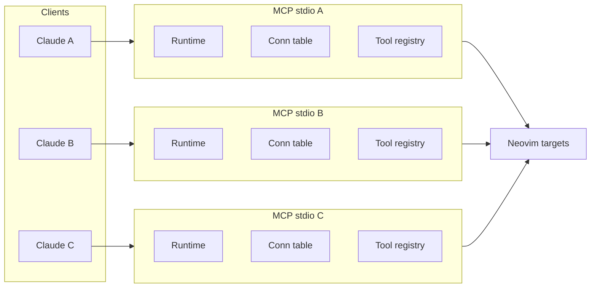
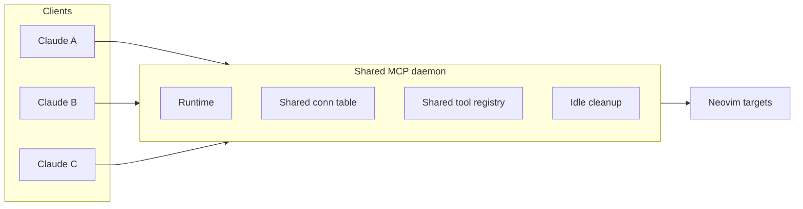
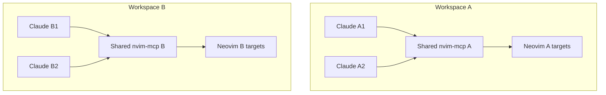

# nvim-mcp 上下文与内存优化分析报告

日期：2026-03-15

## 1. 结论摘要

你的直觉基本是对的，但要分成两层来看：

1. **LLM 上下文占用**
   MCP 的主要上下文成本来自 `tool name + description + input schema`。动态 tools 越多，`list_tools` 暴露给模型的 schema 越大，提示词膨胀越明显。
2. **进程/内存占用**
   真正更大的系统级成本，通常不是“单次调用”，而是“每个 Claude Code 会话各起一个 `nvim-mcp` 进程”。在默认 `stdio` 模式下，这会重复创建 Tokio runtime、MCP server、连接表、动态 tool 注册表，以及到同一个 Neovim 的独立 RPC 连接。

对这个仓库来说，**最大优化点不是抠单个 tool 的几 KB，而是把多会话多进程改成共享一个长生命周期的 MCP server**。如果你现在是“多个 tmux pane + 多个 Neovim session + 每个里面再起多个 Claude Code”，那内存会近似按“Claude Code 会话数”线性放大。

## 2. 代码现状

### 2.1 进程模型

- 默认启动模式是 **stdio MCP server**，见 `src/main.rs:238` 与 `docs/usage.md:58`。
- 项目也支持 **HTTP server mode**，见 `src/main.rs:203`、`src/main.rs:205` 与 `docs/usage.md:71`。

这意味着：

- 如果你让每个 Claude Code 会话都自己拉起一个 `stdio` MCP 进程，那么它们之间**没有进程内共享**。
- 只有切到共享的 HTTP/daemon 形态，多个客户端才有机会复用同一个 server 进程。

### 2.2 连接模型

- 所有连接保存在 `nvim_clients: Arc<DashMap<String, Box<dyn NeovimClientTrait + Send>>>`，见 `src/server/core.rs:26`。
- `connection_id` 是按 target 生成的确定性 ID，见 `src/server/core.rs:52`。
- 但这个“确定性”只在**单个进程内部**有效；跨进程并不能共享这张表。

也就是说：

- 同一个 `socket path`，在 1 个 MCP 进程里可以复用。
- 同一个 `socket path`，在 5 个 Claude Code 各自起的 5 个 `stdio` MCP 进程里，会被连接 5 次。

### 2.3 每个连接的内存构成

- `NeovimClientImpl` 内部持有 `Option<NeovimConnection<T>>`，见 `src/neovim/client.rs:450`。
- `NeovimConnection<T>` 包含 `io_handler: JoinHandle<...>`，见 `src/neovim/connection.rs:5`、`src/neovim/connection.rs:10`。
- `connect_path()` 与 `connect_tcp()` 时都会启动后台 task，见 `src/neovim/client.rs:516`、`src/neovim/client.rs:531`、`src/neovim/client.rs:553`、`src/neovim/client.rs:568`。
- `disconnect()` 会 `abort()` 这个后台 I/O handler，见 `src/neovim/client.rs:680`、`src/neovim/client.rs:685`。

所以每条连接至少会带来：

- 一个 Neovim RPC client 对象
- 一个 Tokio task
- 若干 channel / buffer / future 状态
- 该连接对应的动态 tool 注册项

### 2.4 动态 tool 的内存构成

- 动态 tools 是 **per-connection** 的，见 `docs/features-explained.md:331`、`docs/features-explained.md:336`。
- Lua tools 连接后会做发现与注册，见 `src/server/lua_tools.rs:199`、`src/server/core.rs:158`、`src/server/core.rs:173`。
- 动态 tool 存储结构是：
  - `dynamic_tools: Arc<DashMap<String, ConnectionToolMap>>`
  - `connection_tools: Arc<DashMap<String, HashSet<String>>>`
  见 `src/server/hybrid_router.rs:86`、`src/server/hybrid_router.rs:89`、`src/server/hybrid_router.rs:118`。

这说明现在至少存在两类重复：

- 同一个 tool name 被存两次索引
- 同一个连接下的 tool name 会同时出现在 `dynamic_tools` 和 `connection_tools` 里

### 2.5 上下文成本并不完全等于连接数

- `list_tools` 走 `self.hybrid_router.list_all_tools()`，见 `src/server/resources.rs:234`。
- 已有仓库调查指出：`list_all_tools()` 对“同名动态 tool”只取**任意一个连接**的定义做全局展示，见 `docs/dynamic-tool-system-investigation-report.md:116`。

因此：

- **内存成本** 随连接数和动态 tool 实例数增长
- **LLM 上下文成本** 更接近“对外暴露的唯一 tool schema 总数”

如果多个连接暴露的是同名同 schema 的 tool，上下文未必线性翻倍；但 server 内存仍会涨。

## 3. 当前能确认的“现在状态”

基于这次会话能直接确认的只有两点：

- 当前挂载到本会话的 `nvim-mcp` 资源 `nvim-connections://` 返回空数组，说明**这个已挂载实例当前没有活跃连接**。
- 当前挂载实例的 `nvim-tools://` 返回 8 个静态 tools。

但仓库文档 `docs/tools.md:3` 写的是 “The server provides 33 MCP tools”。这说明：

- 运行中的已挂载 MCP 实例和当前仓库工作树**可能不是同一版本**
- 或文档把连接态/动态暴露也算进去了

所以这份报告不对“当前 RSS 就是 X MB”做伪精确结论，而是给出**可靠的结构性判断**：

```text
总内存 ~= 进程基线 * MCP进程数
       + 每连接状态 * 活跃连接数
       + 动态tool元数据 * 动态tool实例数
       + Tokio任务/队列 * 活跃RPC连接数
```

如果你现在的使用方式是：

```text
多个 tmux pane
  -> 多个 Claude Code 会话
    -> 每个会话各起一个 stdio nvim-mcp
      -> 每个进程再各自连接一个或多个 Neovim
```

那么总内存大概率是 **按 Claude Code 会话数近似线性增长**，这比“同一进程里多几个动态 tool”更伤。

### 3.1 最小真实 stdio 客户端握手后的测量结果

现在报告里的主测量脚本是：

- `scripts/measure_connected_mcp_memory.py`

这个脚本做的不是伪 benchmark，而是：

1. 启动 `target/release/nvim-mcp`
2. 用 Python 最小 MCP 客户端通过 `stdio` 发 `initialize`
3. 再发 `notifications/initialized` 和 `tools/list`
4. 在真实握手建立后采样 `nvim-mcp` 的 RSS

但要注意，**当前脚本是裸启动 `nvim-mcp`**，等价于：

```bash
nvim-mcp
```

它**没有**带上你平时配置里的：

```bash
nvim-mcp --connect auto --log-file ./nvim-mcp.log --log-level debug
```

所以这组数据回答的是：

> “一个最小 stdio MCP 客户端连上裸启动的 `target/release/nvim-mcp` 后，它大概占多少内存？”

它和你的实际使用场景**部分一致、但不完全一致**：

- 一致：每个客户端各起一个独立的 stdio `nvim-mcp` 进程
- 不一致：当前测量没有覆盖 `--connect auto` 带来的 Neovim 连接、动态 tool 注册和日志开销

也就是说，这组数据仍然很有价值，但更准确地说它是**最小真实握手基线**，而不是“完整日常使用态”的最终数字。

这次文档采用的最新实测输出文件是：

- `target/benchmarks/memory/mcp-client-rss-20260315T062401038849Z.json`
- `target/benchmarks/memory/mcp-client-rss-20260315T101712010077Z.json`

其中第 2 个文件是当前最新的 3-client 结果。

结果如下：

| 场景 | RSS / 合计 RSS |
|------|----------------|
| 1 个真实 MCP 客户端连接 1 个 `target/release/nvim-mcp` | `7328 KiB` / `7.16 MiB` |
| 3 个真实 MCP 客户端，各自连接各自的 `target/release/nvim-mcp` | 合计 `23232 KiB` / `22.69 MiB` |

最新 3 客户端场景的分进程结果是：

- 进程 1：`7.47 MiB`
- 进程 2：`7.61 MiB`
- 进程 3：`7.61 MiB`

这组数据说明：

1. **一个最小真实客户端连上后的 `release nvim-mcp`，大致就是 `7 MiB` 量级。**
2. **多个客户端并发时，`nvim-mcp` 的内存基本按实例数线性增长。**
3. **如果把它用于估算你的日常场景，应把它视为偏保守的下界基线，而不是包含 `--connect auto` 后的完整数字。**

### 3.1.1 这组数据和“真实使用场景”的关系

如果你平时像 `docs/nvim.json` 那样配置：

```json
{
  "command": "/Users/pittcat/Dev/Rust/nvim-mcp/target/release/nvim-mcp",
  "args": ["--connect", "auto", "--log-file", "./nvim-mcp.log", "--log-level", "debug"]
}
```

那么当前脚本还少了两层开销来源：

- server 启动后自动发现并连接当前项目里的 Neovim
- 建立连接后可能出现的动态 tool 注册、连接表与相关后台状态

因此当前脚本更适合回答：

- “每个 Claude Code 会话各起一个 `stdio nvim-mcp` 时，server 基线大概多少？”

而不适合直接回答：

- “我平时带 `--connect auto` 连到真实工作中的 Neovim 后，完整占用到底是多少？”

后一个问题如果要严格回答，需要脚本支持传入实际 server 启动参数，并在有真实可发现 Neovim 的前提下重新测量。

### 3.2 当前真实运行态快照

除了上面的受控 benchmark，我又对这台机器的**当前真实运行态**做了快照采样。结果是：

- 当前正在运行的 `target/release/nvim-mcp` 进程数：`4`
- 每个进程 RSS 约 `3776 KiB`，也就是 `3.69 MiB`
- 合计 RSS：`15104 KiB`，约 `14.75 MiB`
- 输出文件：`target/benchmarks/memory/memory-benchmark-20260315T061052Z-live-snapshot.json`

具体进程如下：

| PID | RSS |
|-----|-----|
| `2408` | `3776 KiB` / `3.69 MiB` |
| `6191` | `3776 KiB` / `3.69 MiB` |
| `6854` | `3776 KiB` / `3.69 MiB` |
| `11093` | `3776 KiB` / `3.69 MiB` |

这组数据说明：

1. **当前真实 release 运行态**下，一个 `nvim-mcp` 实例大约就是 `3.7 MiB`。
2. **真实客户端握手后**，一个 `nvim-mcp` 实例大约是 `7 MiB`。
3. 这两组 release 数据的差异，主要来自：
   - live snapshot 测的是当前 steady-state 进程
   - benchmark 测的是新启动后的受控场景
   - benchmark 会主动建立连接并采样多进程并发场景

因此更准确的说法应该是：

- **当前真实 release 运行态**：一个 `nvim-mcp` 实例大约 `3.7 MiB`
- **真实客户端握手后**：一个 `nvim-mcp` 实例大约 `7 MiB`

如果你现在关心“我的机器此刻到底占了多少”，应优先看 `live-snapshot` 结果；如果你关心“一个最小真实 stdio 客户端连上后实际会涨到多少”，应优先看 `measure_connected_mcp_memory.py` 的结果。

要注意，这两组数字都还带有场景限制，因为这次连接的是极简 headless Neovim 或已有运行态快照：

- 没有加载真实工作环境里的插件集合
- 没有复杂 buffer/workspace 状态
- 没有额外动态 tools 压力

所以真实使用中，尤其是你这种“tmux + 多目录 + 单目录多个 Claude Code”的模式，**单进程大致量级可以先按 3.7 MiB 到 7.6 MiB 理解**，而总成本仍然主要取决于你同时起了多少个 `nvim-mcp` 进程。

### 3.3 如何复测并持续保存数据

脚本会把每次结果保存为时间戳 JSON：

```text
target/benchmarks/memory/mcp-client-rss-<UTC时间>.json
```

默认命令：

```bash
python3 scripts/measure_connected_mcp_memory.py --binary ./target/release/nvim-mcp --skip-build
```

常用参数：

```bash
# 改输出目录
python3 scripts/measure_connected_mcp_memory.py --binary ./target/release/nvim-mcp --skip-build --output-dir ./tmp/benchmarks

# 改客户端数量
python3 scripts/measure_connected_mcp_memory.py --binary ./target/release/nvim-mcp --skip-build --client-count 5
```

如果你要模拟“同目录里 3 个 Claude Code 都各起一个 stdio MCP，并且每个都有最小真实客户端握手”，最接近的就是：

```bash
python3 scripts/measure_connected_mcp_memory.py --binary ./target/release/nvim-mcp --skip-build --client-count 3
```

这个脚本现在测的是：

1. 启动 `target/release/nvim-mcp`
2. 让最小 MCP 客户端完成真实握手
3. 测量已连接状态下的 RSS

它**还没有**测到：

1. `--connect auto` 的启动参数
2. 自动连上真实 Neovim 后的连接状态
3. 连接后动态 tool 注册带来的额外开销

## 4. 两类成本拆开看

### 4.1 LLM 上下文成本

大头来自：

- tool 名称
- description
- JSON Schema
- examples / enum / nested object 描述

动态 tools 会放大这个问题，因为它们往往：

- 名字更多
- schema 更长
- 描述更具体

上下文成本的近似公式：

```text
Prompt overhead ~= 暴露给模型的 tool 数量 * 平均 schema 大小
```

### 4.2 服务器内存成本

大头来自：

- 每个 `nvim-mcp` 进程的 runtime / router / logging / deps 常驻开销
- 每个连接的 RPC 状态与后台 task
- 每个动态 tool 的 schema / description / 索引结构

服务器内存的近似公式：

```text
RSS ~= O(process_base)
    + O(connection_count * connection_state)
    + O(dynamic_tool_instances * tool_metadata)
```

## 5. 架构图

### 5.1 当前高成本形态



### 5.2 建议的低成本形态



### 5.3 ASCII 视图

```text
当前:

Claude A -> nvim-mcp A -> Neovim X
Claude B -> nvim-mcp B -> Neovim X
Claude C -> nvim-mcp C -> Neovim X

问题:
- 3 份 runtime
- 3 份连接表
- 3 份动态 tool 注册
- 3 条到同一 Neovim 的 RPC 连接

优化后:

Claude A \
Claude B  --> shared nvim-mcp daemon --> Neovim X
Claude C /

收益:
- runtime 常驻开销只保留 1 份
- 连接表共享
- 动态 tools 共享
- 更容易做 idle cleanup / TTL / metrics
```

## 6. 针对你场景的推荐拓扑

你的实际使用方式不是“一个人开一个 Claude Code”，而是：

- 同一个目录下，同时打开多个 Claude Code
- tmux 里还会同时开多个目录
- 每个目录内部又可能各自有多个 Claude Code

所以最合适的优化单元不是“每个 Claude Code 一个 MCP”，也不是默认“全机器只保留一个全局 MCP”，而是：

```text
每个 workspace/目录 一个共享 nvim-mcp daemon
同一 workspace 下的多个 Claude Code 复用这一个 daemon
不同 workspace 各自维护自己的 daemon
```

### 6.1 推荐方案：每目录一个共享 daemon



这个方案最适合你现在的模式，因为它同时解决两类问题：

- **同目录内重复进程**：多个 Claude Code 不再重复起 `nvim-mcp`
- **跨目录隔离性**：不同 workspace 的连接表、tool surface、动态 tools 不会混在一起

### 6.2 为什么不建议默认做成“全局唯一 daemon”

全局单 daemon 当然也能省内存，但它会带来新的问题：

- 所有目录的连接都堆进同一个连接表
- 所有目录的动态 tools 都进入同一个 tool surface
- LLM 看见的工具和连接上下文会更杂
- 不同项目之间的权限边界和行为边界更模糊

对于你的场景，更现实的取舍通常是：

- **内存第一优先**：可以考虑全局单 daemon
- **上下文干净、项目隔离、易维护**：优先每目录一个 daemon

### 6.3 三种部署方式对比

| 方案 | 适合同目录多 Claude Code | 适合多目录并存 | 内存表现 | 上下文干净程度 | 运维复杂度 |
|------|--------------------------|----------------|----------|----------------|------------|
| 每个 Claude Code 一个 `stdio` MCP | 差 | 差 | 最差 | 最干净 | 最低 |
| 每目录一个共享 daemon | 很好 | 很好 | 好 | 好 | 中 |
| 全局唯一 daemon | 好 | 一般 | 最好 | 最差 | 中 |

我的建议顺序是：

1. 先把“同目录多个 Claude Code”收敛成“每目录一个 daemon”
2. 只有当你机器上同时开的目录非常多、而且内存压力仍然明显时，再评估是否进一步压到“全局唯一 daemon”

### 6.4 这份建议如何覆盖你的场景

覆盖关系如下：

```text
场景 1: 同目录 3 个 Claude Code
  -> 由 3 个 stdio MCP
  -> 收敛为 1 个 workspace daemon

场景 2: tmux 中同时开 5 个目录
  -> 每个目录各自 1 个 daemon
  -> 总计 5 个 daemon，而不是 15~20 个 Claude Code 各起一个

场景 3: 每个目录里还有多个 Neovim session
  -> 仍然由该目录下的共享 daemon 统一管理连接表与动态 tools
```

也就是说，这套优化**完全 cover 你的场景**，只是推荐的目标不是“只保留一个全局 MCP”，而是：

```text
按 workspace 聚合，而不是按 Claude Code 实例切分
```

## 7. 优化建议

下面按收益优先级排序。

### P0. 把“同目录多 `stdio` 进程”改成“每目录一个共享 MCP daemon”

这是收益最大的优化。

建议：

- 每个 workspace 固定起一个 `nvim-mcp --http-port <PORT>` 共享进程
- 同一目录下的多个 Claude Code 都连这个共享 server
- 不再让每个 Claude Code 会话单独拉起自己的 `stdio` 进程

原因：

- `stdio` 天然是“一客户端一进程”
- HTTP/daemon 才有可能共享连接表和动态 tool 注册表
- 按 workspace 收敛，既能省内存，又能保留项目级隔离

预期收益：

- **进程基线内存** 直接从 `N * process_base` 下降到 `1 * process_base`
- 在单个 workspace 内，同一个 Neovim target 不再被多个 server 重复连接

对于你的真实使用方式，更准确的收益公式是：

```text
原始形态:
  daemon_count ~= Claude Code 会话数

优化后:
  daemon_count ~= workspace 数
```

### P1. 动态 tool 改成 lazy discovery，而不是 connect 时全量发现

现在动态 tool 发现入口在 `src/server/lua_tools.rs:199`，并在连接建立后注册，见 `src/server/core.rs:158`、`src/server/core.rs:173`。

建议：

- 首次 `list_tools` 或首次命中某连接时再发现
- 对 discovery 结果做 TTL cache
- 当 Lua registry 未变化时，不重复注册

收益：

- 减少连接建立时的峰值成本
- 减少“连接了但没真正用”的动态 tool 常驻开销

### P1. `list_tools` 改成更小、更按需的暴露面

现在 `list_tools` 汇总全局工具，见 `src/server/resources.rs:234`。这会把不一定会用到的 schema 都暴露给模型。

建议：

- 未连接时，只暴露 `connect` / `connect_tcp` / `get_targets`
- 已连接后，优先暴露“当前 connection 的工具”
- 对动态 tools 支持按 namespace / group 过滤

收益：

- 直接降低 prompt 体积
- 降低模型“看见太多工具”的选择噪音

### P1. 压缩 tool schema 和 description

对 LLM 上下文最直接。

建议：

- description 只保留决策所需信息
- 把长示例、边界说明、使用指南挪到 resources/docs
- 减少嵌套对象层级和冗长 enum 描述
- 高频基础操作合并成更稳定的少数几个工具

经验规则：

- 说明文字越像 README，越浪费 prompt
- tool 描述应该只解决“模型要不要选它、参数怎么填”这两个问题

### P2. 压缩动态 tool 注册表的数据结构

当前动态 tool 存储同时维护：

- `tool_name -> connection_id -> tool`
- `connection_id -> tool_name set`

见 `src/server/hybrid_router.rs:86`、`src/server/hybrid_router.rs:89`、`src/server/hybrid_router.rs:118`。

建议：

- 引入共享的 `Arc<DynamicToolMeta>`，把 schema / description / validator 从 executor 分离
- per-connection 只保存轻量引用或 `(tool_name, connection_id)` 键
- 如果读多写少，可评估 `RwLock<HashMap<...>>` 是否比双层 `DashMap` 更省
- 对重复的 tool name / description 做 string interning

收益：

- 降低重复字符串和 `HashSet` / `DashMap` 元数据开销
- 在连接数和动态 tools 变多时更平滑

### P2. 增加空闲连接回收

文档已经建议“用完就 `disconnect`”，见 `docs/usage.md:145`，但这依赖人手执行。

建议：

- 增加 idle timeout
- 长时间无 RPC 的连接自动断开
- 断开时同步调用 `unregister_dynamic_tools`

收益：

- 避免 tmux / Claude Code 留下的僵尸连接长期占内存

### P3. 用统一 dispatcher 替代大量细粒度动态 tools

如果你的核心痛点是“prompt 太大”，可以更激进一些。

思路：

- 暴露一个 `call_dynamic_tool` / `exec_capability`
- 参数里带 `connection_id + tool_name + args`
- 把动态工具目录放到资源或单独查询接口里

取舍：

- 优点：大幅缩小 tool surface
- 缺点：模型对单个具体能力的可发现性下降

这更适合“工具很多，但模型并不需要全量看见”的场景。

## 8. 我对“有没有优化空间”的判断

有，而且空间不小，但优先级很明确：

1. **先优化部署形态**
   从“每个 Claude Code 一个 `stdio` 进程”改成“每个 workspace 一个共享 server”，这是最大头。
2. **再优化暴露给模型的 tool surface**
   这主要解决 prompt/context 膨胀。
3. **最后再优化内部数据结构**
   这有价值，但收益通常不如前两项直接。

换句话说：

- 如果你现在是 6 个 Claude Code 会话、分布在 2 个目录，就先收敛成 2 个共享 `nvim-mcp` 进程。
- 不要先花很多时间在 `DashMap` 或字符串 intern 这种二级优化上。

## 9. 建议的落地顺序

### 方案 A：只做运维级优化，最快见效

1. 每个 workspace 改为长期运行的 `nvim-mcp` HTTP server
2. 同目录下多个 Claude Code 共用该 workspace server
3. 增加“空闲自动 disconnect”策略

### 方案 B：做产品级优化，兼顾上下文

1. 未连接时仅暴露连接工具
2. 已连接后按 connection/group 暴露工具
3. 动态 tool 改 lazy discovery
4. description 和 schema 做瘦身

### 方案 C：做内部结构优化

1. 重构 dynamic registry，减少双索引和重复字符串
2. 共享 schema/meta，executor 与 metadata 解耦
3. 视读写比例评估 `DashMap` 是否需要替换

## 10. 本次分析的限制

- 当前报告已经补上了本机 RSS 实测，但它仍然是**最小化基准**，不是你全部真实插件和真实工作集下的峰值。
- 当前 MCP 挂载实例显示的 tool 数量与仓库文档存在差异，因此不能把它当成“唯一真实的运行态基准”。

但不影响这份报告最核心的判断，因为源码已经足够说明：

- 默认是 `stdio` 多进程模型
- 连接和动态 tools 只在进程内共享
- 每个连接都有后台 task 与注册表项
- 共享 daemon 才是最大优化杠杆

## 11. 一句话结论

如果你的目标是同时优化 **prompt 上下文** 和 **系统内存**，最有效的路线是：

**先把同一 workspace 下的多个 Claude Code 会话收敛到一个共享 `nvim-mcp` 进程，再做动态 tool 的按需暴露和 lazy discovery。**


```bash
python3 scripts/measure_connected_mcp_memory.py --binary ./target/release/nvim-mcp --skip-build --client-count 3
```


  python3 scripts/measure_connected_mcp_memory.py --client-count 3                           
