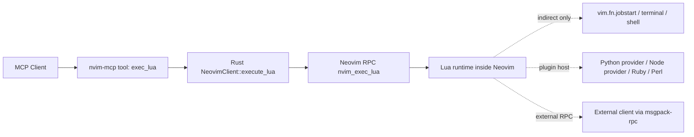

# nvim-mcp 多语言执行能力调研报告

调研日期：2026-03-21

## 结论摘要

当前这个项目**原生只支持执行 Lua**，没有 `exec_python`、`exec_ts`、`exec_js` 之类的 MCP 工具。

原因很直接：

- 工具层只暴露了 `exec_lua`：`docs/tools.md`
- 服务端实现也只有 `exec_lua()`：`src/server/tools.rs:338`
- Neovim 客户端最终调用的是 `conn.nvim.exec_lua(...)`：`src/neovim/client.rs:773`

但这不等于“不能跑 Python / TypeScript / 其他语言”。更准确的说法是：

1. **这个仓库当前只能直接把 Lua 送进 Neovim 执行。**
2. **Python / Node.js / Ruby / Perl 可以通过 Neovim provider / remote plugin 体系接入。**
3. **TypeScript 没有 Neovim 内建的 `:ts` 执行入口，但可以通过 Node.js 生态或 Deno 生态实现。**
4. **任何能讲 MessagePack-RPC 的语言，都可以作为外部客户端连到 Neovim，而不是经由本项目的 `exec_lua`。**
5. **如果只是“借 Neovim 这台机器跑别的解释器”，也可以从 Lua 间接调用外部进程，但那属于 shell/作业调度，不是 Neovim 原生多语言执行 API。**

## 仓库当前能力边界

### 已有能力

- 发现 Neovim 实例并建立连接
- 读取 buffer / 导航 / 获取光标信息
- 通过 MCP 工具 `exec_lua` 执行 Lua 代码

### 当前没有的能力

- 没有 `exec_python`
- 没有 `exec_js`
- 没有 `exec_ts`
- 没有“通用脚本执行器”或“按语言选择 host”的抽象层

### 实际调用链



## Neovim 自身提供了什么

Neovim 官方文档把可编程入口分成几层：

### 1. 直接执行 Lua

Neovim API 暴露 `nvim_exec_lua()`，可以让外部客户端通过 RPC 把 Lua 片段送进 Neovim 执行。这正是本项目现在用的路径。

对本项目的含义：

- 这是**当前唯一的一等执行入口**
- 返回值、错误处理、上下文都比较直接
- 能力边界清晰

### 2. Provider / Remote Plugin

Neovim 官方 provider 文档明确支持：

- Python provider
- Node.js provider
- Ruby provider
- Perl provider

这些不是“任意一段 Python/JS 代码随手 eval”，而是**把某种语言作为 Neovim 的插件宿主**。它们更像“多语言插件运行时”，不是“即时脚本执行 API”。

对本项目的含义：

- 可以借 provider 把多语言逻辑挂进 Neovim
- 但 `nvim-mcp` 需要再设计一层调用方式，才能把这些能力暴露成 MCP 工具
- 否则只能通过 Lua 触发已有命令 / 函数 / remote plugin

### 3. 外部 RPC 客户端

Neovim API 文档明确说明，外部进程可以通过 MessagePack-RPC 连接到 Neovim。官方文档给了 Ruby 和 `pynvim` attach 的示例。

对本项目的含义：

- Python、Node.js、Rust、Go 等都可以直接做 Neovim client
- 这种方式**绕开了 `nvim-mcp` 的 `exec_lua`**
- 如果目标是“让 Python/TS 程序控制 Neovim”，不一定要把能力塞进这个仓库

## Python 路径

### 路径 A：`pynvim` 作为外部客户端

`pynvim` 官方 README 给出了两类能力：

- `attach('socket', path=...)` 连接已有 Neovim 实例
- 作为 Python remote plugin host

这说明 Python 能做两件事：

1. 像本项目一样，直接连 Neovim socket 做 API client
2. 作为 Neovim 的 Python provider / remote plugin 运行时

适合的场景：

- 想在 Neovim 外面写 Python 自动化
- 想把一批 Python 功能做成 remote plugin，再由 Neovim 命令调用

不适合直接得出的结论：

- 不能因为 `pynvim` 能 attach，就说 `nvim-mcp` 已经支持 Python 执行
- `pynvim` 证明的是 **Neovim 支持 Python 客户端/宿主**，不是本仓库已经有对应 MCP 接口

### 路径 B：Python provider / `:python3`

Neovim provider 文档说明：

- `g:python3_host_prog` 用来指定 Python 3 host
- `pynvim 0.6.0+` 是推荐路径
- Neovim 支持 Python remote plugins

这条路偏“Neovim 插件生态”。

对本项目的现实含义：

- 可以新增一个设计，例如 `exec_python`，其实现不是“Neovim 原生 API”，而是：
  - 由 Lua 调用某个 Python remote plugin 暴露的命令/函数
  - 或由 Lua 启动 Python 子进程并收集输出
- 这会引入 host 管理、环境管理、错误映射、超时控制等额外复杂度

### Python 结论

Python **可以集成**，但当前仓库**没有原生 Python 执行工具**。如果要支持，工程上有三种选择：

1. 最轻量：Lua 间接启动 `python3`
2. 更 Neovim 化：接 Python provider / remote plugin
3. 更解耦：让 Python 程序自己 attach Neovim，不经过本项目

## TypeScript / JavaScript 路径

### 路径 A：Node.js provider + `neovim` node client

Neovim 官方 provider 文档明确支持 Node.js remote plugins；`neovim/node-client` README 说明：

- 远程插件模式下，需要全局安装 `neovim` npm 包
- 包本身既是 API client，也是 Node.js remote plugin host
- remote plugin 放在 `rplugin/node/`
- README 里的 API 示例本身就是 TypeScript 风格签名

这意味着：

- **JavaScript 路径是官方内建 provider 支持的**
- **TypeScript 路径通常不是 Neovim 直接解释 TS，而是通过 Node 生态构建/加载**

换句话说，Node provider 原生是“Node.js 宿主”，不是“`exec_ts` 即时求值接口”。

### 路径 B：Denops（Deno + TypeScript/JavaScript）

`vim-denops/denops.vim` README 明确写着：

- 这是 Vim/Neovim 的 Deno 生态
- 允许开发者用 TypeScript / JavaScript 写插件

这条路对“直接写 TS 插件”更友好，尤其在 Deno 环境下比较自然。

但要注意：

- 这是第三方生态，不是 Neovim core provider
- 对本项目来说，依赖面和运维面都比 Lua / Python / Node provider 更重

### TS/JS 结论

- **JavaScript：官方支持得最直接，走 Node provider / remote plugin 即可**
- **TypeScript：可以做，但通常依赖 Node 构建链或 Deno/Denops，不是当前仓库现成能力**
- 如果你要的是“给 MCP 一个 `exec_ts`”，那需要新增宿主层设计，而不是简单复用 `nvim_exec_lua`

## 其他语言路径

### 官方 provider 直接支持

Neovim 官方 provider 文档还提到：

- Ruby
- Perl

这两类都能作为 remote plugin host。

### 更通用的路径：任意语言的 RPC client

Neovim API 文档说明，外部程序可以通过 MessagePack-RPC 调用 Neovim API。理论上，只要某种语言有可用的 msgpack-rpc 客户端，或者有现成 Neovim client 库，就能接入。

因此“其他代码”可以分成两类：

1. **在 Neovim 里作为插件宿主运行**
2. **在 Neovim 外作为 RPC 客户端控制 Neovim**

后者其实比“给这个仓库加一个新 `exec_<lang>`”更通用。

### 最宽松但最不 Neovim-native 的路径

从 Lua 里启动外部进程，例如：

- `jobstart()`
- `:terminal`
- shell 命令

这可以跑 Python、Node、bash、Ruby、Go 可执行文件，甚至任何 CLI。

但这类方案本质上是：

- Neovim 当作调度入口
- 语言运行时在 Neovim 外执行
- 返回值通常要自己约定 stdout/stderr/exit code 协议

所以它适合“执行脚本”，不适合冒充“Neovim 多语言原生 API”。

## 能力分类图

```ascii
+-----------------------------------------------------------------------------------+
|                           nvim-mcp / Neovim 多语言执行版图                        |
+----------------------+-------------------------+----------------------------------+
| 层级                 | 代表能力                | 说明                             |
+----------------------+-------------------------+----------------------------------+
| 当前仓库原生         | exec_lua                | 直接 RPC 到 nvim_exec_lua        |
| Neovim 官方 provider | Python / Node / Ruby / Perl | 作为 remote plugin host      |
| 外部客户端           | pynvim / node-client / 其他RPC库 | 直接 attach/socket 控制   |
| 间接执行             | jobstart / terminal / shell | 启动外部解释器或可执行文件  |
| 第三方生态           | Denops                  | 用 Deno 跑 TS/JS 插件            |
+----------------------+-------------------------+----------------------------------+
```

## 对这个项目最现实的几种方案

### 方案 1：维持 `exec_lua` 单一入口，不扩展新语言工具

做法：

- 保持现在的 `exec_lua`
- 在文档里说明如何通过 Lua 去调用 remote plugin / 外部进程

优点：

- 架构最简单
- 不引入 host 生命周期管理
- 与当前代码实现完全一致

缺点：

- 用户体验不够“直达”
- Python / TS 需要用户自己铺路

适用判断：

- 如果这个项目定位是“Neovim 控制面”，这是最稳的路径

### 方案 2：新增语言专用工具，例如 `exec_python`

做法：

- MCP 层新增 `exec_python`
- 底层通过 Lua 调 Python host / remote plugin / 外部进程

优点：

- 对 MCP 用户更友好
- 可以做参数约束、输出结构化、超时与沙箱

缺点：

- 需要解决 Python 环境选择、虚拟环境、host 探测、错误映射
- `exec_ts` 的设计比 `exec_python` 更麻烦，因为 TS 不是 Neovim core provider 的一等语言

适用判断：

- 如果你要把 `nvim-mcp` 做成“多语言执行网关”，这是可行方向
- 但建议先做 Python，再评估 TS

### 方案 3：新增“通用外部进程执行”工具，而不是 `exec_<lang>`

做法：

- 例如设计 `spawn_process` / `run_script`
- 明确它是“在 Neovim 上下文里调用外部命令”，而不是“Neovim 原生解释器”

优点：

- 一次覆盖 Python、Node、bash、Ruby、Go 二进制等
- 抽象更统一

缺点：

- 安全边界更敏感
- 更像远程命令执行能力，必须严肃处理权限和输入输出协议

适用判断：

- 如果诉求是“跑任何代码”，这比分别加 `exec_python`、`exec_ts` 更合理

### 方案 4：不改本项目，让不同语言直接 attach Neovim

做法：

- Python 用 `pynvim`
- Node/TS 用 `neovim` node client
- 其他语言用对应 RPC client

优点：

- 最符合 Neovim 设计
- 不把所有能力都绑到 `nvim-mcp`

缺点：

- 不会变成统一 MCP 接口

适用判断：

- 如果目标是“让不同语言自己控制 Neovim”，这是最干净的架构

## 推荐意见

### 如果目标是“现在就能用”

优先顺序建议：

1. 保持 `exec_lua`
2. 文档补充“通过 Lua 间接触发 Python / Node / shell”的实践方式
3. 把 provider / remote plugin / external RPC client 的边界写清楚

原因：

- 当前仓库还没有多语言宿主抽象
- 直接加 `exec_ts` 会把“Node/TS/Denops/构建链”问题一次性带进来

### 如果目标是“下一步扩展”

建议路线：

1. 先做 `exec_python` 可行性验证
2. 再决定是走 provider / remote plugin，还是外部进程执行
3. TypeScript 单独作为第二阶段，不建议和 Python 一起一口气做

原因：

- Python 路线在 Neovim 官方文档里最成熟，`pynvim` 也最常见
- TypeScript 真正落地时通常会触到 Node 构建链或 Denops 生态，复杂度明显更高

## 一句话判断

这个项目现在是：

- **Lua 直接执行：已经支持**
- **Python：Neovim 能支持，但本项目还没暴露成 MCP 工具**
- **TypeScript：可以接入，但通常要借 Node 或 Deno 生态，不是当前项目现成功能**
- **其他语言：要么走 provider / remote plugin，要么走外部 RPC client，要么走外部进程执行**

## 参考资料

以下都尽量使用官方或项目一手资料：

- Neovim API 文档：<https://neovim.io/doc/user/api.html>
- Neovim provider 文档：<https://raw.githubusercontent.com/neovim/neovim/master/runtime/doc/provider.txt>
- `pynvim` README：<https://raw.githubusercontent.com/neovim/pynvim/master/README.md>
- `neovim/node-client` README：<https://raw.githubusercontent.com/neovim/node-client/master/README.md>
- Denops README：<https://raw.githubusercontent.com/vim-denops/denops.vim/main/README.md>

## 附：本仓库相关定位

- `docs/tools.md` 只列出 `exec_lua`
- `src/server/tools.rs:338` 实现 `exec_lua`
- `src/neovim/client.rs:789` 调用 `conn.nvim.exec_lua(code, lua_args).await`

因此，若后续要支持 Python / TS / 其他语言，建议把问题拆成两层：

1. **Neovim 本身是否支持这种语言的宿主/客户端路径？**
2. **`nvim-mcp` 是否要把它包装成一个新的 MCP 工具？**

这两件事不要混在一起，否则很容易把“Neovim 生态可实现”误写成“本项目已经支持”。
